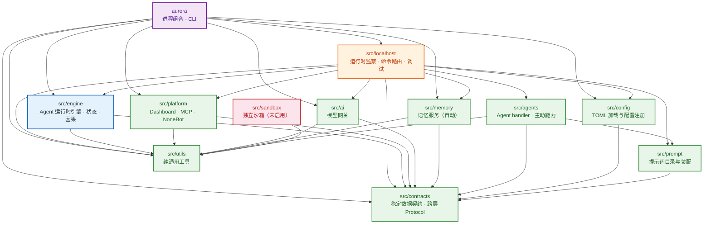

# 包依赖关系

本文档描述 AuroraBot 源码包之间的导入依赖与硬边界。**持续与实现保持同步**。

## 指导原则

### 1. 以 Agent 为中心

此项目的一切初衷和哲学是让 Agent 拥有**最大限度的自由度和灵活度**。架构的每一个决策应从 Agent 视角出发：Agent 能做什么、Agent 需要什么、Agent 如何自主。

**系统必须设计简洁。** 如果为了让 Agent 有更灵活的决策而增加系统复杂度，绝对不可取。Agent 的自由不应以牺牲系统清晰度为代价——简单的系统更可靠，可靠的系统才能承载自由的 Agent。

具体体现：

- Agent 的认知决策（handler）只接受 `AgentContext`，只产出 `AgentDecision`。系统不得在决策链路中插入隐式过滤、改写或替 Agent 做判断。
- 外部能力（工具、记忆、模型、平台）通过 Port 注入，Agent 无需感知具体实现——给它一个干净的决策环境。
- 自动服务（记忆）是 Agent 的**潜意识**，不应侵占 Agent 的 token 预算或决策注意力。
- 能用简单方案解决的问题，不得为"未来可能更灵活"而引入抽象层。

### 2. 注释使用中文（仅注释）

重构时，所有注释必须使用**简体中文**。代码标识符、变量名、函数名、类名、字符串字面量仍使用英文。

```python
# 正确

# 错误
```

### 3. 硬编码文本上提为文件级枚举

每个文件中所有硬编码文本（无论语言）必须提取到文件开头，使用 `StrEnum` 继承类统一声明。目的是方便后续国际化（i18n）。

```python
class _Msg(StrEnum):
    """本文件内所有用户可见或日志输出的字符串常量。"""
    COMPOSER_REQUIRED = "ToolAgent requires an installed PromptComposer"
    TOOL_UNAVAILABLE = "暂无可用执行器"
    INVALID_OUTCOME = "Tool outcome status and summary must be valid"

# 使用
raise RuntimeError(_Msg.COMPOSER_REQUIRED)
```

规则：

- 类名固定为 `_Msg`（模块私有）
- 枚举项的键为大写蛇形，值为原始字符串
- 同一个文件中不允许重复定义字符串字面量——统一引用 `_Msg`
- 仅包含**硬编码文本字符串**，不含日志格式模板、类型标记或序列化键

### 3a. 异常消息简化

所有异常消息（包括 `raise`、`assert`、`ValueError` 等抛出的字符串）必须遵守两条规则：

1. **能移除模板就直接移除。** 如果异常信息无需变量插值，使用纯枚举字符串，不套模板。
2. **必须使用 `_Msg` 枚举。** 任何异常消息字符串不得以字面量形式直接写在 `raise` 语句中。

```python
# 正确：无变量插值 → 纯枚举，无模板
class _Msg(StrEnum):
    COMPOSER_REQUIRED = "ToolAgent requires an installed PromptComposer"
    ALREADY_BOUND = "Tool executors are already bound"

raise RuntimeError(_Msg.COMPOSER_REQUIRED)

# 正确：需要变量插值 → 使用 .format() 引用枚举
class _Msg(StrEnum):
    DUPLICATE_CAPABILITY = "duplicate active Tool capability: {capability}"

raise ToolBindingError(_Msg.DUPLICATE_CAPABILITY.format(capability=capability))

# 错误：字面量直接写死在 raise 中
raise RuntimeError("ToolAgent requires an installed PromptComposer")
```

### 4. 代码规整优先

务必保证代码**规整、优雅、Pythonic**。不得为了解决个例问题使用不优雅的特判（special-case hack）。

- 遵循项目 Ruff 配置（行宽 120、双引号、LF）
- dataclass 优先 `slots=True`、`frozen=True`
- Protocol 只声明签名，不给默认实现
- 公共 API 提供类型注解
- 一个函数一个职责。
- 特判是最昂贵的代码——如果遇到无法归入现有模式的个例，先考虑模式是否应该扩展，而非在调用点打补丁。

### 5. 不可决策时提问

凡不能通过既有上下文（本文档、代码库、已确立的设计判断）决策的问题，必须**向用户提问**，不得擅自假设或静默选择。

包括但不限于：模块归属不清、命名有歧义、边界条件不确定、两种方案各有优劣且文档未给出明确取舍。

## 架构全景

两条正交路径：

| 路径         | 包                                              | 角色                                                                   | 方向                                 |
| ------------ | ----------------------------------------------- | ---------------------------------------------------------------------- | ------------------------------------ |
| **热路径**   | `engine` → Ports → `platform` / `ai` / `memory` | Agent 认知闭环：事件摄入 → 决策 → 模型调用 → 工具执行 → 记忆           | 引擎通过注入的 Port 驱动适配器       |
| **检查路径** | `localhost` → 所有包                            | 运行时状态监察、命令路由、调试接口、输入分发                           | `localhost` 检查一切，不被热路径依赖 |
| **组合**     | `aurora`                                        | 进程入口：构造 engine + 注入 Port + 启动平台 + 挂载 localhost 命令路由 | 唯一组合根                           |

### 依赖全景

箭头方向为「依赖者 → 被依赖者」。`localhost` 是监察 sidecar，注入所有需要检查的包，但**不在热路径中**——engine 的 pump 循环不经过 localhost。



### 分层职责

| 层           | 包              | 职责                                                                                               | 可依赖                     |
| ------------ | --------------- | -------------------------------------------------------------------------------------------------- | -------------------------- |
| **进程层**   | `aurora`        | 唯一进程 CLI、平台选择、生命周期组合、engine + Port 构造、挂载 localhost 命令路由与主事件循环      | 所有下层                   |
| **监察层**   | `src/localhost` | 运行时状态检查、`/` 命令路由、调试 API、输入分发。**可自由 import 任何 src/ 包**                   | 所有底层（设计如此）       |
| **引擎层**   | `src/engine`    | Inbox 防抖、Triage、Task/Agent、邮箱、Activity、因果边界、SQLite                                   | contracts · utils          |
| **适配层**   | `src/platform`  | Dashboard / MCP / NoneBot 外部生态协议适配。实现 `ToolExecutor` 与 `ExternalAmpIngressPort` Port | contracts · utils          |
| **模型层**   | `src/ai`        | 宽泛模型网关。实现 `ModelProvider` Port                                                            | contracts · utils          |
| **记忆层**   | `src/memory`    | 有界会话摘要与长期事实投影。实现 `MemoryStore` Port                                                | contracts · utils          |
| **认知层**   | `src/agents`    | Triage 入口 agent、同构 Agent handler + 主动能力（delegate / wait / speech / memory）            | prompt · contracts · utils |
| **配置层**   | `src/config`    | TOML 加载、校验、注册中心与热重载                                                                  | contracts                  |
| **提示词层** | `src/prompt`    | 提示词目录、分层 DTO 与模型上下文装配                                                              | contracts                  |
| **契约层**   | `src/contracts` | **所有**跨层共享的不可变 dataclass 与 Port Protocol                                                | 仅标准库                   |
| **工具层**   | `src/utils`     | 无上层依赖的纯通用工具                                                                             | 仅标准库                   |
| **沙箱**     | `src/sandbox`   | 独立沙箱组件；当前运行时不启用                                                                     | 仅 utils                   |

---

## 命令与输入路由

用户输入从平台进入、经命令路由、到引擎执行，全程通过 **Port 注入** 避免平台层直接依赖 localhost。

### 机制

1. `contracts/ports.py` 定义 `InteractiveInputPort` Protocol（`route_input(request) → CommandResult`）
2. `contracts/event.py` 定义 `RuntimeInput`、`CommandResult`、`InputOrigin` 等 DTO
3. `localhost` **实现** `InteractiveInputPort`（`CommandRouter` 是其内部组件）
4. `aurora` 在构造时将 localhost 实例作为 `InteractiveInputPort` **注入**到需要交互输入的平台
5. Platform 只 import `contracts`，通过注入的 Port 调用 `route_input()`，不 import `localhost`

### 完整流程

```
Console (src/console/shell.py)
  │  stdin 读取用户输入
  │  import: contracts.event.RuntimeInput, contracts.ports.ConsoleControlPort
  │  不 import: src.localhost
  │
  ▼
ports.route_input(RuntimeInput)
  │  ← aurora 在 run_runtime() 中将 localhost 实例注入到 console shell
  │
  ▼
localhost (CommandRouter)
  ├─ 非 `/` 前缀 → 转为 AMP → submit_amp() → engine._amp_queue
  └─ `/` 前缀  → shlex 分词 → 命令目录匹配 → 执行 handler → CommandResult
                   │
                   ├─ /status   → engine.status()
                   ├─ /pump N   → engine.pump(N)
                   ├─ /task ID  → engine.task_detail(ID)
                   ├─ /agent ID → engine.agent_detail(ID)
                   ├─ /say ...  → submit_conversation()
                   ├─ /quit     → stop_event.set()
                   └─ ...
  │
  ▼
CommandResult
  │  ok: bool, text: str | None, control: CommandControl (NONE / CLEAR_CONSOLE / SHUTDOWN_PROCESS)
  │
  ▼
Console shell 根据 CommandResult 决定输出内容 / 清屏 / 退出
```

### 为什么 Platform 不 import localhost

如果 Platform 直接 import `src.localhost.router`：

- Platform 变成 `platform → localhost → engine/ai/memory/...` 扇入链
- localhost 的任何改动都可能波及 Platform
- Platform 的单元测试需要 mock 整个 localhost 依赖树

如果 Platform 通过 Port 接收注入：

- Platform 只依赖 `contracts`（Protocol + DTO）
- Platform 与 localhost 完全解耦——替换 localhost 实现不需要改 Platform
- Platform 单元测试只需 mock `InteractiveInputPort`

`contracts/ports.py` 中仅一个 Protocol 即可完成注入：

```python
class InteractiveInputPort(Protocol):
    """平台通过此端口将用户输入路由到命令系统或对话引擎。"""
    async def route_input(self, request: RuntimeInput) -> CommandResult: ...
```

### 额外平台（Dashboard、NoneBot）复用同一机制

Dashboard 同样接收注入的 `InteractiveInputPort`，用户在 Web 面板输入 `/status` 走完全相同的路由：

```
Dashboard HTTP/WS → routing.py → InteractiveInputPort.route_input(RuntimeInput) → 同一条 localhost 路由
```

新增平台只需：构造函数接受 `InteractiveInputPort` 参数，`aurora` 负责注入。无需 import localhost。

---

## 能力分类

Aurora 的能力扩展分为三种正交类型：

| 类型         | 位置                                  | 触发方式                  | 例子                                                        | 本质                                                                                                     |
| ------------ | ------------------------------------- | ------------------------- | ----------------------------------------------------------- | -------------------------------------------------------------------------------------------------------- |
| **自动服务** | `src/memory/` 等，注入 engine 的 Port | 自动（pump hook）         | memory（记忆注入/回忆）、prompt assembly、因果记录          | 发生**于** Agent，不由 Agent 决策。像潜意识——Agent 不"调用"记忆，记忆结果自动出现在上下文中。            |
| **主动能力** | `agents/capabilities/`                | Agent 决策（模型 token）  | delegate、wait、speech (TTS)                                | 由 Agent **主动选择**使用。是 Agent 认知决策空间的一部分——Agent 决定"我要委派"、"我要等待"、"我要朗读"。 |
| **工具能力** | `platform/<name>/`                    | Agent 决策 → tool request | dashboard.send、MCP tools、NoneBot QQ actions | Agent 想要触发的**外部效果**。Agent 决定"我要在 Dashboard 聊天里发送这段文字"，工具系统执行。本地 Console 不再属于工具能力：Bot 文本默认由 console 渲染。 |

### 三种类型的关系

```
┌─────────────────────────────────────────────────────┐
│                   Agent Turn                         │
│                                                      │
│  自动服务 (被动)         主动能力 (模型决策)           │
│  ┌──────────────┐      ┌──────────────────┐         │
│  │ MemoryStore  │      │ SpeechCapability │         │
│  │ 上下文注入    │      │ "我应该朗读这段"  │         │
│  │ (Agent 无感)  │      │ → tool_request   │         │
│  └──────────────┘      └────────┬─────────┘         │
│                                 │                    │
│                                 ▼                    │
│                          ┌──────────────┐           │
│                          │ engine pump  │           │
│                          │  工具调度     │           │
│                          └──────┬───────┘           │
│                                 │                    │
│  工具能力 (外部执行)              │                    │
│  ┌───────────────────────────────▼─────────────┐    │
│  │ Platform executor → 渲染音频 / 发送消息 / ...│    │
│  └─────────────────────────────────────────────┘    │
└─────────────────────────────────────────────────────┘
```

关键区别：记忆是 **subconscious 的**——发生在 Agent turn 之前/之后，由 engine 的 pump hook 自动触发，Agent 不会输出 "let me recall something"。朗读/委派/等待是 **conscious 的**——Agent 在 turn 内自主决定是否使用，体现在模型的 token 输出中。

### 关于多模态理解

归为**模型层能力**——不属于上述三种之一。`ai` 网关声明模型支持的输入模态（文字/图片/音频），平台在 AMP 事件中附上多模态数据，prompt composer 将对应的内容片段注入 AgentContext。Agent 无需感知模型是否支持多模态——不支持时网关返回错误，engine 标记该 turn 失败。

### 如若新增能力时的流程

**新增自动服务**（如情感分析）：

1. 在独立服务包中实现，实现对应的 Port Protocol
2. 在 `aurora/runtime.py` 中将实例注入 engine
3. engine 在 pump hook 中自动调用——Agent 无感知

**新增主动能力**（如 TTS speech）：

1. 在 `agents/capabilities/speech.py` 中实现——读取 `AgentContext`，决定是否生成 tool request
2. 在 `config/agents.toml` 中注册到对应 agent profile
3. 需有对应平台 executor 执行 `tts.speak` tool request
4. 无需修改 engine 或 contracts

**新增工具平台**（如 NoneBot）：

1. 在 `platform/nonebot/` 中创建 adapter——实现 `ToolExecutor` Protocol，接收 QQ 消息并转为 AMP
2. 在 `config/platforms.toml` 中声明 `[platform.nonebot]` 启停配置
3. 在 `__init__.py` 中实现相关工厂
4. 无需修改 engine、contracts 或 agents

---

## 各包详细设计

### `src/contracts` — 契约层（最底层）

零外部依赖。**所有跨层 DTO 和 Port Protocol 的唯一来源**。

```
contracts/
  __init__.py
  agent.py           # AgentHandler, AgentDecision, AgentContext, AgentInstance,
                     # Capability, CapabilityDescriptor, CapabilityCatalogSnapshot,
                     # EngineConfiguration, AgentProfile, AgentLimits,
                     # TaskLimits, ToolLease, ActivityRequest
  amp.py             # AmpEnvelope, new_amp (AMP 信封构造工厂)
  model.py           # ModelRequest, ModelResult, ModelUsage, ModelMessage,
                     # ModelProvider Protocol (engine 调用模型的标准接口)
  tool.py            # ToolExecutionRequest, ToolOutcome, ToolOutcomeStatus,
                     # ToolExecutor Protocol (engine 调用工具的标准接口),
                     # ToolExecutorBinding, RecoveryBinding
  event.py           # RuntimeInput, CommandResult, CommandContext, CommandControl, InputOrigin
  ports.py           # ExternalAmpIngressPort, InteractiveInputPort（平台→命令路由注入）,
                     # ConsoleControlPort, DashboardControlPort, DashboardDebugPort,
                     # ToolQueuePort, ToolCompletionPort, RuntimeCommandPort
  configuration.py   # AuroraConfig, PlatformPreference (及各平台配置片段)
  memory.py          # MemoryContextSnapshot, MemoryEntry, MemoryQuery, MemoryStore Protocol
  triage.py          # InboxEvent, TriageBatch, TriageLimits
```

**关键约束**：

- 全部 `@dataclass(frozen=True, slots=True)`
- Protocol 只声明方法签名，不提供默认实现
- 不 import 任何 `src.*` 包

---

### `src/utils` — 工具层（最底层）

零外部依赖。

```
utils/
  __init__.py
  logging.py         # get_logger("aurora.<module>") — 统一日志工厂（含 rich 终端日志）
  serialization.py   # extract_json_from_text, atomic_write_json — JSON 解析与原子写入（含 yaml 序列化）
  time.py            # utc_now, now_text, from_epoch_seconds — 时间格式化与计时工具
```

**与原始设计的小差异**：`logging.py` 内部使用 `rich`，`serialization.py` 内部使用 `yaml`。这两个第三方依赖在 `pyproject.toml` 中声明，utils 包不引入 `src.*` 依赖。

---

### `src/config` — 配置层

只依赖 `contracts`。

```
config/
  __init__.py        # init(root, profile) / get() → AuroraConfig
  files.py           # TOML/Markdown 文件读取与 SHA-256 来源快照
  loader.py          # 按包名加载所有 config/*.toml，合并为单一不可变快照
  prompts.py         # prompts.toml 与 Markdown 内容快照
  sections.py        # TOML 各节解析函数（_parse_agent_runtime, _parse_preference 等）
  registry.py        # 配置注册中心：get() / init()
```

加载的文件（一个包一个文件）：

| 文件             | 对应包       | 产出 DTO 片段                                  |
| ---------------- | ------------ | ---------------------------------------------- |
| `runtime.toml`   | 进程级       | `RuntimeConfig` (profile, debug)               |
| `engine.toml`    | engine       | `EngineConfig` (workspace, limits, budgets)    |
| `models.toml`    | ai           | `ModelsConfig` (providers, roles)              |
| `platforms.toml` | platform     | `PlatformsConfig` (per-platform settings)      |
| `agents.toml`    | agents       | `AgentsConfig` (profiles, capabilities)        |
| `apps.toml`      | platform/mcp | `AppsConfig` (MCP connections)                 |
| `prompts.toml`   | prompt       | `PromptConfig` (fragment content and sources)  |
| `logging.toml`   | utils        | `LoggingConfig` (level, log_dir)               |
| `storage.toml`   | 跨包         | `StorageConfig` (data_root, per-package paths) |

**关键约束**：

- `get()` 零参数调用，返回进程级不可变快照（`AuroraConfig` 是 frozen）
- 模块导入不得隐式读取配置或创建目录
- 密钥仅来自环境变量，TOML 只声明 `secret_env = "ENV_VAR_NAME"`

---

### `src/prompt` — 提示词层

只依赖 `contracts`。

```
prompt/
  __init__.py        # PromptCatalog, PromptComposer
  models.py          # PromptCatalog — 从启动配置快照构造的不可变片段集合
  composer.py        # PromptComposer — 从 AgentContext 装配 PromptDocument
```

**关键约束**：

- `PromptSection` / `PromptDocument` 不下沉 contracts——它们是装配层内部结构，定义于 `prompt/models.py`
- 唯一跨层交汇点 `ModelMessage` 已在 `contracts.model`

---

### `src/memory` — 记忆层（自动服务）

依赖 `contracts` + `utils`。实现 `MemoryStore` Protocol。**记忆是自动服务，不由 Agent 主动决策**——Agent 不"调用"记忆；engine 在 pump 前后自动注入记忆上下文和保存完成的任务。

```
memory/
  __init__.py
  service.py         # MemoryService — 单一 SQLite；会话摘要、长期事实、幂等回执
  executor.py        # MemoryToolExecutor — 主动记忆写入的 ToolExecutor（RFC 0207，与自动投影同源）
```

**构造与注入**：

```python
memory_service = MemoryService(memory_dir)
engine = AgentEngine(config, handlers, memory_store=memory_service)
```

**关键约束**：

- 实现 `MemoryStore` Protocol，不定义新的跨层类型
- 作为 Port 注入 engine——Agent handler 不直接持有 memory_service
- engine 在 Agent turn 前取得不可变快照；Prompt composer 将其作为独立 Memory System 消息

---

### `src/engine` — 引擎层

依赖 `contracts` + `utils`。**自包含的 Agent 运行时引擎**。不依赖 prompt / config / ai / agents / platform / memory。

```
engine/
  __init__.py
  runtime.py          # AgentEngine — 单循环无租约运行时（RFC 0210）
                       #   构造签名：
                       #     AgentEngine(configuration, handlers, *,
                       #                 model_provider, memory_store=None,
                       #                 idle_wait_seconds=1.0)
                       #   属性：
                       #     tasks(), get_task(), get_agent(), has_work(), status()
                       #     task_detail(), agent_detail()
                       #   pump 闭环：
                       #     1. recover tools → tool_registry.recover()
                       #     2. ingest → 持久化 Inbox + 动态防抖
                       #     3. triage → 批次创建入口 triage Task（RFC 0209）
                       #     4. Agent turn / Tool / Model 调度（triage 判断走正常链路）
                       #     5. 异步 Memory 投影（终态留存 SQLite，RFC 0210）
  authorize.py        # 决策构造、授权校验与应用（RFC 0208 拆包）
  ingress.py          # AMP 持久化摄入与幂等回执（RFC 0208 拆包）
  tool_registry.py    # ToolRegistry — 管理多个 ToolExecutor 分发的引擎内部聚合类
  debug.py            # task_detail() / agent_detail() / 工作区校验
  store/              # SQLite 运行态与终态留存子包（Schema v9，RFC 0210）
    __init__.py       # SQLiteRuntimeStore — 组合 3 个 Mixin 的 WAL facade
    schema.py         # DDL (inbox_events, tasks, agents, messages, activities, causal_events)
    base.py           # 连接/事务/行映射/崩溃恢复
    runtime.py        # 状态与查询（任务树、消息时间线、统计计数）
    decisions.py      # AgentDecision 八分支状态机 + 消息/活动队列
    inbox.py          # Inbox 摄入、防抖批次、入口 triage Task 与批次结算
```

**AgentEngine 构造签名**：

```python
class AgentEngine:
    def __init__(
        self,
        configuration: EngineConfiguration,
        handlers: dict[str, AgentHandler],
        *,
        model_provider: ModelProvider,         # 来自 contracts.model
        tool_registry: ToolRegistry,           # 来自 contracts.tool（聚合多个 ToolExecutor）
        memory_store: MemoryStore | None = None, # 来自 contracts.memory
    ) -> None: ...
```

**Pump 闭环**（在 `runtime.py` 的 `pump()` 方法内完整执行）：

```
pump(max_turns):
  1. recover tools      → self._tool_registry.recover_pending()
  2. ingest              → AMP 文件 + 内存队列写入 inbox_events（同时追加会话 JSONL）
  3. triage due batches  → 每个批次创建 Task 与入口 triage agent（RFC 0209，纯同步，无模型调用）
  4. execute turns       → handle_claim() 在线程池中并发执行（triage 的模型判断走正常 model Activity）
  5. dispatch I/O        → ToolRegistry + ModelProvider
  6. memory projection   → 后台更新会话摘要和长期事实
  7. 终态留存        → 终态 Task 留在 SQLite（无文件归档，RFC 0210）
```

**关键约束**：

- 不 import `src.ai` / `src.platform` / `src.memory` / `src.agents` / `src.prompt` / `src.config` / `src.localhost`
- `runtime.py` 组合 Agent turn 与 I/O 调度；Inbox 事务位于 `store/inbox.py`（RFC 0209/0210）。
- `store/` 是子包，`SQLiteRuntimeStore` 在其中组合多 Mixin，替换了文档中的单体 `store.py`。
- 所有权通过 `contracts` 中的 Protocol 注入
- `ToolRegistry` 是 engine 内部的聚合类（非 contracts），管理多个 `ToolExecutor` 实现的分发
- engine 的 `status()` / `task_detail()` / `agent_detail()` 是透明查询接口，供 `localhost` 监察使用

---

### `src/ai` — 模型层

依赖 `contracts` + `utils`。实现 `ModelProvider` Protocol。

```
ai/
  __init__.py
  gateway.py          # ModelGatewayService — 实现 ModelProvider Protocol（原 vnext.py）
                       #   complete(request: ModelRequest) → ModelResult
                       #   supports_multimodal() → bool
  models.py           # 模型角色、能力协商、Provider 适配表
  providers.py        # 模型解析（resolve_model）与 Provider 参数配置
  execution.py        # acompletion + stream（Chat Completions API）
  _channels.py        # Chat Completions / Responses 双通道调度
  _parsing.py         # 响应解析与提取
```

**关键约束**：

- 只暴露 `ModelGatewayService` 作为 `ModelProvider` 实现
- 多模态支持是模型级别的——网关声明哪些模型支持 vision/audio
- 如果 Agent 提交了模型不支持的模态，网关返回错误——engine 标记该 turn 失败

---

### `src/agents` — 认知层

依赖 `contracts` + `prompt` + `utils`。**同构 Agent handler + 主动能力**。

Agent 能力只包含**模型可自主决策使用的**能力——即 Agent 在 turn 内主动选择是否调用。自动服务（如记忆注入）不属于此层。

```
agents/
  __init__.py
  triage.py          # TriageAgent — 注意力初筛入口 Agent（无工具、结构化输出、fail-open）
  handler.py         # ToolAgent — 基础 AgentHandler 实现
  capabilities/       # 主动能力（Agent 自主决策）
    __init__.py
    delegate.py       # DelegationCapability — 创建子 Agent 委派任务
    wait.py           # WaitCapability — 延迟执行
    speech.py         # SpeechCapability — 决定输出是否朗读，生成 tts.speak tool request
    memory.py         # MemoryCapability — 主动记忆写入请求（RFC 0207，执行由 memory 层承担）
  tools.py            # Agent 内建工具的 CapabilityDescriptor 定义
```

> **注意**：`memory` 不在此列——记忆是自动服务（`src/memory/`），由 engine 的 pump hook 自动触发，不由 Agent 决策。Agent 不"调用"记忆；记忆结果自动注入到它的 `AgentContext` 中。
> 不过在后期, 我们可以同样将记忆作为一个可以指派的 agent , 所以此处需要保证 agent 实现的规整性.

**主动能力的设计模式**：

每个能力通过 setter 注入其依赖（不 import 外部包），在 `handle()` 中根据 `AgentContext` 自主决定是否使用：

```python
# agents/capabilities/speech.py
class SpeechCapability(Capability):
    """决定 Agent 回复是否应朗读，生成 tts.speak 工具请求。"""
    def __init__(self) -> None:
        self._tts_enabled = False

    def install_tts_config(self, enabled: bool) -> None:
        self._tts_enabled = enabled
```

注入发生在 `aurora` 进程组合层：

```python
speech = SpeechCapability()
speech.install_tts_config(enabled=config.agents.tts_enabled)
```

**关键约束**：

- 不 import `src.ai` / `src.platform` / `src.memory` / `src.engine` / `src.config`
- 外部依赖通过 setter 注入，类型声明为 `Any` 或 Protocol
- `handle()` 只读 `AgentContext`，返回 `AgentDecision`（可能包含 `tool_requests`）
- 一次模型响应中的文本与全部 Tool call 都必须保留；执行层可以为恢复而组织批次或链，但不得截断、伪造拒绝
  结果或禁止模型组合控制能力与外部效果能力
- 主动能力可生成 tool request（如 speech → `tts.speak`），由平台负责执行

---

### `src/platform` — 适配层

依赖 `contracts` + `utils`。实现 `ToolExecutor` 和 `ExternalAmpIngressPort` Protocol。**只依赖 `contracts`**。

```
platform/
  __init__.py
  dashboard/          # Web 面板平台
    __init__.py
    adapter.py        # DashboardPlatform — 实现 ToolExecutor (dashboard.send)
    api.py            # REST API (FastAPI routes)
    communication.py  # DashboardCommunication — 实时消息分发
    routing.py        # 输入路由 (HTTP/WS → RuntimeInput → input_port.route_input())
  service.py         # ChatService — 聊天编排与会话管理
  server.py          # SignalSafeServer — uvicorn 辅助类（禁用信号捕获）
  store.py           # ChatStore — Dashboard 自有 SQLite 持久化（含 token 生成原语）
  mcp/                # MCP 协议平台
    __init__.py
    adapter.py        # MCPPlatform — 实现 ToolExecutor + ExternalAmpIngressPort
    client_manager.py # stdio / Streamable HTTP 连接管理与 Tool 缓存
    server_kit.py     # 本地 stdio MCP server 进程生命周期
    server_spec.py    # MCP server 启动规范 dataclass
  # 规划中：
  nonebot/            # NoneBot 兼容平台
    __init__.py
    adapter.py        # NoneBotAdapter — 实现 ToolExecutor + ExternalAmpIngressPort
                      #   接收 QQ 消息 → AMP
                      #   暴露 QQ 动作 (send_message, kick_member 等) 为 Tool
```

**每个平台的统一接口**：

每个平台 adapter 实现：

- `ToolExecutor` Protocol：`execute_tool(request: ToolExecutionRequest) → ToolOutcome`
- 可选 `RecoveryBinding`：`recover_tool(request) → ToolOutcome`（幂等恢复）
- 可选 event ingress：将外部事件（stdin、WebSocket、MCP notification、QQ 消息）转为 `AmpEnvelope` 并通过 `ExternalAmpIngressPort` 提交

交互式平台（Dashboard）的构造函数接受 `InteractiveInputPort` 注入（定义在 `contracts/ports.py`），用于将用户输入路由到 localhost 的命令系统；本地 Console 是独立于平台的运行时前端（见 `src/console`）：

```python
# Console shell
async def run_console(
    control: ConsoleControlPort,   # ← aurora 注入 localhost 实例
    query: RuntimeQueryPort,       # ← 只读输出流查询端口
    *,
    stop_event: asyncio.Event,
) -> None:
    while not stop_event.is_set():
        text = await read_stdin()
        request = RuntimeInput(text=text, origin=InputOrigin.CONSOLE, ...)
        result = await control.route_input(request)  # ← 通过 Protocol 调用，不 import localhost
        handle_result(result)
```

**平台注册流程**（在 `aurora/runtime.py` 中）：

```python
# 1. 创建平台实例
dashboard = DashboardPlatform(chat_service)
mcp = MCPPlatform(config)

# 2. 收集 ToolExecutorBinding
bindings = [
    ToolExecutorBinding(DASHBOARD_SEND_DESCRIPTOR, dashboard, "platform.dashboard", "local"),
    *[ToolExecutorBinding(cap, mcp, "platform.mcp", instance) for cap in mcp.capability_catalog],
]

# 3. 注入到 engine
engine.install_tool_registry(ToolRegistry(bindings))
```

**Console 前端**：不注册 Tool 能力；`--headless` 或 `[runtime].console.enabled = false` 时不启动。启动时 shell 后台循环按游标轮询 `RuntimeQueryPort.output_stream()` 并打印 `Bot> <text>`，因此 Bot 文本不调用任何工具也会默认出现在本地终端。

**新增平台只需**：在 `platform/<name>/` 中实现 `ToolExecutor` + event ingress，在 `aurora/runtime.py` 中注册。无需修改 contracts、engine、agents。

---

### `src/localhost` — 监察层

依赖**所有** `src/*` 包。`localhost` 是运行时监察 sidecar——它不在引擎热路径中，而是侧挂的**上帝式监察器**，负责：

- **命令路由**：解析 `/` 前缀命令，分发到确定性业务用例（`/status`、`/pump`、`/task`、`/agent`、`/help` 等）
- **运行时检查**：读取 engine、platform、ai、memory 的状态快照
- **调试 API**：`/v1/debug/*` 端点，提供脱敏的 Task/Agent/运行态投影
- **输入分发**：将纯文本从 Console / Dashboard 规范化为 AMP 并投递

```
localhost/
  __init__.py
  runtime.py          # AuroraRuntime — 组合根 light wrapper
                      #   持有 engine + command_router
                      #   暴露统一的 run_forever() / pump() / status() / shutdown()
                      #   实现 contracts.ports.InteractiveInputPort（route_input）
  router.py           # CommandRouter — `/` 前缀判定与命令分发
  registry.py         # 命令目录注册
  api.py              # create_debug_app() — `/v1/debug/*` FastAPI 端点
  commands/           # 各 `/` 命令实现
    status.py         # /status — engine status
    pump.py           # /pump N — 推进 N 个 engine turn
    say.py            # /say — 以文本创建 AMP/Task
    event.py          # /event — 提交自定义 AMP 事件
    task.py           # /task — 查询 Task 详情
    agent.py          # /agent — 查询 Agent 详情
    clear.py          # /clear — 清除 Console 屏幕
    log.py            # /log — 控制终端日志级别
    quit.py           # /quit — 优雅停止进程
    help.py           # /help — 显示命令列表
```

> 注：`command_types.py` 和 `ports.py`（原 localhost 中的 DTO/Protocol）迁移到 `contracts/event.py` 和 `contracts/ports.py`。`tool_dispatcher.py` 迁移到 `engine/`——工具调度是热路径操作，属于引擎职责。`autonomy.py` 暂移除——自主额度等高可用性功能延后。

**localhost 的设计定位**：

```
                          aurora (注入)
                            │
              ┌─────────────┼─────────────┐
              ▼             ▼             ▼
        Console       Dashboard       (NoneBot)
     (InteractiveIP) (InteractiveIP) (InteractiveIP)
              │             │             │
              └─────────────┼─────────────┘
                            │ contracts.ports.InteractiveInputPort
                            ▼
                     ┌──────────────┐
                     │  localhost   │
                     │              │
                     │ 命令路由      │
                     │ 状态检查      │──────────→ engine (只读查询)
                     │ 调试 API     │──────────→ platform / ai / memory (只读)
                     │ 输入分发      │──────────→ engine (submit_amp)
                     └──────────────┘
```

`localhost` **在热路径之外**。engine 的 pump 循环不经过 localhost——engine 通过注入的 Port 直接调用 platform、ai、memory。`localhost` 与 engine 并行持有引用，仅用于命令路由、状态检查和输入分发。

平台通过 `InteractiveInputPort`（定义在 `contracts/ports.py`）接收 localhost，而不是直接 import。详见 [命令与输入路由](#命令与输入路由)。

**关键约束**：

- `localhost` 可以自由 import 任何 `src/*` 包——它是监察器，需要全知
- `localhost` 实现 `contracts.ports.InteractiveInputPort`——平台通过 Protocol 调用，不 import localhost
- 不 import `aurora/*`——进程组合层是最顶层
- 不在 engine pump 热路径中——engine 不 import localhost
- `/` 命令不包含业务逻辑——命令 handler 读取状态、触发操作、返回结果，不做认知决策

---

### `aurora` — 进程组合层

依赖所有实现包。**唯一可以同时 import 所有 `src.*` 包的层**。

```
aurora/
  __init__.py
  __main__.py        # python -m aurora
  main.py            # CLI argparse，命令分发
  runtime.py         # run_runtime() — 构造 engine + 注入 Port + 启动平台 + 主事件循环
  registry.py        # register_commands() — 子命令注册
  process.py         # run_process() — 子进程辅助
  commands/          # CLI 子命令实现
    __init__.py
    check.py         # aurora check — 代码检查与 lint
    donk.py          # aurora donk — 版本管理
```

**`aurora/runtime.py` 的组装流程**：

```
run_runtime():
  1. 加载配置           → get_config()
  2. 创建 PromptComposer → PromptCatalog.from_config() + PromptComposer()
  3. 创建 MemoryService  → MemoryService(memory_dir)    # 自动服务
  4. 加载 TriageAgent    → 与其他 profile 同构走 _load_handler（RFC 0209）
  5. 创建主动能力        → DelegationCapability, WaitCapability, SpeechCapability
  6. 加载 AgentHandler   → _load_handler(spec, composer, capabilities)
  7. 创建 AI Gateway     → ModelGatewayService(config)
  8. 创建平台适配器       → DashboardPlatform, MCPPlatform
  9. 收集 ToolBinding     → 各平台的 ToolExecutorBinding
  10. 构造 engine        → AgentEngine(config, handlers,
                            model_provider=...,
                            tool_registry=...,
                            memory_store=memory_service)
  11. 注册 ToolExecutors → engine.tool_registry.add_all(bindings)
  12. 挂载 localhost     → AuroraRuntime(engine, model_gateway, memory_service, ...)
                            # AuroraRuntime 实现 contracts.ports.InteractiveInputPort
  13. 注入 localhost 到平台 → 平台通过 InteractiveInputPort Protocol 接收，不 import localhost
  14. 启动本地前端      → run_console(control=localhost, query=localhost)（非 headless 时）
   13. 启动主循环          → engine.run_forever() + 平台各自的事件循环
```

**关键约束**：

- 一个进程只有一个 engine 所有者
- `run_forever()` 主事件循环由 `aurora` 管理
- 命令路由（`/` 前缀判定）由 `localhost` 承担，`aurora` 只做最外层的循环管理

---

### `src/sandbox` — 沙箱（孤立）

仅依赖 `utils`。

```
sandbox/
  __init__.py
  config.py           # SandboxConfig dataclass + ConfigReloader（原 settings.py）
  base.py             # 沙箱数据类：SandboxResult, SecurityViolation, SandboxConfigError
  manager.py          # SandboxManager — 对外唯一门面与模块单例
  executor.py         # 独立代码执行器
  inspector.py        # 代码安全检查
  paths.py            # 沙箱路径隔离管理
  policy.py           # 安全策略定义
```

完全独立，不被任何包导入，当前 Agent 运行时不启用。

---

## 硬边界

| 规则                                                                                                      | 说明                                                                    |
| --------------------------------------------------------------------------------------------------------- | ----------------------------------------------------------------------- |
| `src/` 不得导入 `aurora/`                                                                                 | 进程组合层是最顶层                                                      |
| engine 不依赖 `prompt` / `config` / `ai` / `agents` / `platform` / `memory`                               | 外部服务通过 Port Protocol 注入，engine 只 import `contracts` + `utils` |
| engine 不依赖 `localhost`                                                                                 | localhost 是监察 sidecar，不在热路径中                                  |
| Platform / ai / memory 只依赖 `contracts` + `utils`                                                       | 适配器同级对等                                                          |
| Agent handler 不直接写运行态 / 调用 Provider / 操作平台 Client                                            | 只返回 `AgentDecision`                                                  |
| Agent 主动能力的外依赖通过 setter 注入，不 import 外部包                                                  | 保持 agents 包边界干净                                                  |
| `contracts` 是所有跨层 DTO 和 Protocol 的唯一来源                                                         | 所有 Port 和跨层 DTO 统一在此                                           |
| `localhost` 可自由导入任何 `src/*` 包                                                                     | 监察器需要全知                                                          |
| 依赖方向（热路径）：`contracts ← utils ← engine / ai / platform / memory / agents ← aurora`               | 实现包同级对等                                                          |
| 依赖方向（检查路径）：`contracts ← utils ← engine / ai / platform / memory / agents ← localhost ← aurora` | localhost 挂在热路径侧面，只查不改                                      |

## 关键设计判断

- **engine 是自包含的热路径引擎**：完整 pump 循环在 engine 内部，外部服务通过 Port 注入。engine 不需要 localhost。
- **localhost 是监察 sidecar**：不在引擎热路径中。它可自由引入任何包，执行运行时状态检查、命令路由和调试接口。没有人依赖它；它依赖所有人。
- **`contracts` 是唯一的跨层契约来源**：所有 Port Protocol 和跨层 DTO 统一归入 contracts。
- **所有适配器同级对等**：engine / ai / platform / memory / agents （除 localhost 外）只依赖 `contracts` + `utils`，彼此之间无直接 import。
- **自动服务通过 Port 注入 engine**：记忆等自动服务在 pump hook 中被动触发，Agent 不参与决策——Agent "被记住"而非"决定记住"。
- **主动能力通过 setter 注入 Agent handler**：delegate、wait、speech 等由 Agent 在 turn 内自主选择使用。
- **工具平台按 Protocol 接入**：新增平台只需实现 `ToolExecutor` + event ingress，注册到 `aurora` 组合层。
- **`aurora` 是唯一组合根**：创建所有实例、注入 Port、组装 localhost 监察器、运行主事件循环。
- **`prompt` DTO 不下沉 contracts**：装配层内部 DTO 不是跨层契约。
- **`sandbox` 完全孤立**：只依赖 utils，不被任何包导入。

## 工作区

每个包在其私有持久化目录中读写运行时数据。路径通过 TOML 配置声明，遵循 `{package_name}` 命名，内部扁平化。

```text
data/
  engine/          # runtime.sqlite3 (WAL), inbox/, archive/（仅 Inbox 分类）
  memory/          # memory.sqlite3：会话摘要、长期事实、幂等回执
  ai/              # models.dev 能力缓存
  platform/
    dashboard/     # Dashboard 数据库 + Token.txt
    mcp/
      apps/        # MCP 平台运行的内建应用私有数据（org.aurora.clock 等）
  logs/            # 日志文件
```

### 路径声明

持久化路径通过 `config/storage.toml` 声明（详见 [配置](#配置) 节），路径层级镜像包层级：
`src/engine → data/engine`、`src/platform/dashboard → data/platform/dashboard`、
`src/platform/mcp → data/platform/mcp`、`src/apps（由 platform/mcp 运行）→ data/platform/mcp/apps`。

### 强制规则

- 持久化路径不得在代码中硬编码。全部从 TOML 配置读取。
- 路径以包名命名（`data/engine/`、`data/platform/mcp/` 等），允许的嵌套关系见 `storage.toml`。
- 外部 AMP 摄入使用 JSON，先写临时文件再原子改名。运行态与终态统一使用 SQLite WAL（Schema v9）。
- 无 JSON 归档与 JSONL 会话日志（RFC 0210）：终态即留存于 SQLite，会话可读性由 causal_events 提供。

## 配置

配置文件与包的对应关系：一个包一个配置文件，一个文件一个清晰职责。

```
config/
  runtime.toml          # 进程级：profile、debug API
  engine.toml           # 引擎级：workspace、Agent 限制、Task 预算、pump 并发
  models.toml           # AI 网关：Provider 定义、Role→模型端点映射
  platforms.toml        # 平台：各平台启停、私有安全配置、本地体验偏好
  agents.toml           # Agent：profile、主动能力授权、委派边界（capabilities 支持 `!` 排除语义）
  apps.toml             # MCP：App 连接、transport、timeout
  prompts.toml          # 提示词：片段文件路径映射
  logging.toml          # 日志：级别、文件路径
  storage.toml          # 持久化：data_root、各包子目录路径
  profiles/
    prod.toml           # 生产 profile（仅覆盖 runtime.toml）
    dev.toml            # 开发 profile（仅覆盖 runtime.toml）
```

### 各文件定义

#### `runtime.toml` — 进程级参数

```toml
[runtime]
# 激活的 profile（prod / dev）
profile = "prod"

[runtime.debug]
# 调试 API 绑定地址，生产必须为 loopback
host = "127.0.0.1"
# 调试 API 端口
port = 8765
```

#### `engine.toml` — 引擎运行时参数

```toml
[engine]
# 工作区根目录，相对于项目 root
workspace = "data/engine"

[engine.agents]
root_profile = "builtin.triage"  # 入口 triage agent（RFC 0209）
worker_profile = "builtin.worker"
max_active_agents = 16
max_agents_per_task = 8
max_depth = 3
max_children_per_agent = 4
turn_concurrency = 8
model_concurrency = 4
tool_concurrency = 8
blocking_workers = 4
[engine.triage]
model_role = "fast"
quiet_seconds = 0.4
max_wait_seconds = 1.5
defer_seconds = 5.0
max_defer_seconds = 60.0
max_batch_events = 24
max_batch_characters = 12000

[engine.interactive_task]
max_model_calls = 8
max_tool_calls = 6
max_duration_seconds = 300.0

[engine.autonomous_task]
max_model_calls = 3
max_tool_calls = 2
max_duration_seconds = 120.0
```

#### `storage.toml` — 持久化路径

```toml
[storage]
data_root = "data"

# 各包的数据子目录，相对 data_root，路径层级与包层级一致
engine = "engine"
memory = "memory"

[storage.platform]
data_dir = "platform"

[storage.platform.dashboard]
data_dir = "dashboard"

[storage.platform.mcp]
data_dir = "mcp"
# MCP 平台运行内建应用的私有数据目录（相对 data_dir）
apps_dir = "apps"
```

#### `logging.toml` — 日志

```toml
[logging]
level = "INFO"
log_dir = "logs"
```

#### `models.toml`、`platforms.toml`、`agents.toml`、`apps.toml`、`prompts.toml`

内容不变，符合"一个包一个文件"原则。

### 加载顺序

1. `config/` 下所有 TOML 文件按名加载
2. 选定 profile 对应 `profiles/{name}.toml`，**仅覆盖 `runtime.toml`**（表递归合并，标量与数组整体替换）
3. Profile 不得覆盖 engine / storage / models / platforms / agents / apps / prompts / logging
4. 环境变量仅用于密钥注入（`secret_env`），不得静默覆盖任何 TOML 值
5. 未知键、类型不匹配、无效引用 → 启动前失败

### 强制规则

- 结构性配置使用 TOML；JSON 不得承担主配置职责；YAML 不进入配置链
- 一个配置文件对应一个包职责，不交叉覆盖
- 密钥仅来自环境变量，TOML 只声明环境变量名
- 除 `AURORA_PROFILE` 外，环境变量不得静默覆盖 TOML
- `src.config` 集中持有：`init(root, profile)` 在进程早期加载，`get()` 零参数获取不可变快照；配置变更通过重启生效
- 模块导入不得隐式读取配置或创建运行目录
