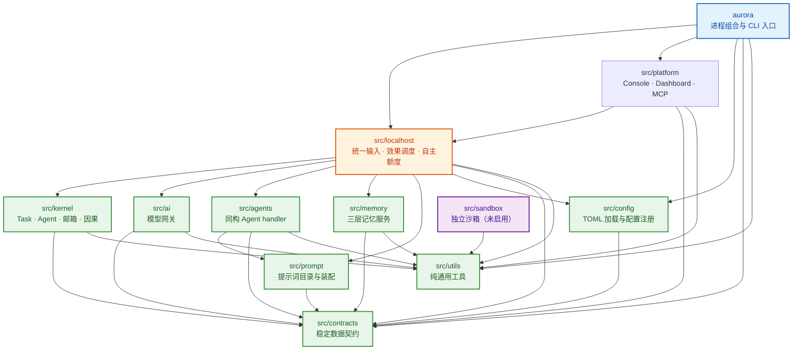

# 包依赖关系

本文档描述 AuroraBot 源码包之间的实际导入依赖与硬边界。设计基准见 `docs/rfc/0100-architecture.md`。

## 依赖全景

箭头方向为「依赖者 → 被依赖者」；越靠下越底层，不得反向导入。

## 分层职责

| 层 | 包 | 职责 | 可依赖 |
| --- | --- | --- | --- |
| **进程层** | `aurora` | 唯一进程 CLI、平台选择与生命周期组合 | 所有下层 |
| **平台层** | `src/platform` | Console / Dashboard / MCP 协议适配、持久化与效果执行 | localhost 窄端口 · contracts · utils |
| **编排层** | `src/localhost` | 统一输入、命令路由、效果/工具调度、自主额度、调试接口 | 所有下层（设计如此） |
| **认知层** | `src/agents` | 同构 Agent handler，只读上下文返回无副作用 Decision | prompt · contracts · utils |
| **模型层** | `src/ai` | 宽泛模型网关：角色、能力协商、调用、计费、节流 | contracts · utils |
| **运行态层** | `src/kernel` | Task / Agent / 邮箱 / Activity / 因果边界 / SQLite 运行态 | contracts · utils |
| **记忆层** | `src/memory` | 三层记忆读写服务 | contracts · utils |
| **配置层** | `src/config` | TOML 加载、校验、注册中心与热重载 | contracts |
| **提示词层** | `src/prompt` | 提示词目录、分层 DTO 与模型上下文装配 | contracts |
| **契约层** | `src/contracts` | 无上层依赖的稳定数据契约 | 仅标准库 |
| **工具层** | `src/utils` | 无上层依赖的纯通用工具 | 仅标准库 |
| **沙箱** | `src/sandbox` | 独立沙箱组件；当前运行时不启用 | 仅 utils |

## 各包依赖详情

### `src/contracts` — 契约层（最底层）

零外部依赖。定义 AMP 信封、Agent / Task / Activity 状态、AgentDecision、ModelRequest / ModelResult、ToolDefinition、配置 DTO 与记忆契约。所有跨层共享的不可变 dataclass 与 Protocol 都在此声明。

- 内部自引用：`agent.py` → `contracts.model`，`configuration.py` → `contracts.agent`
- 对外：不导入任何 `src.*` 包

### `src/utils` — 工具层（最底层）

零外部依赖。提供日志（`get_logger`）、序列化（`extract_json_from_text`）与时间工具。被几乎所有上层包依赖，但不依赖任何上层包。

### `src/config` — 配置层

只依赖 `contracts`。负责 TOML 读取、profile 合并、校验与进程级单例（`init` / `get` / `reload` / `subscribe`）。不含业务逻辑，不持有运行态。

- 导入：`contracts.configuration`、`contracts.agent`

### `src/prompt` — 提示词层

只依赖 `contracts`。加载 `prompts.toml` 清单，持有不可变 `PromptCatalog`，并通过 `PromptComposer` 从 `AgentContext` 装配分层 `PromptDocument`。提示词 DTO（`PromptCatalog`、`PromptSection`、`PromptDocument`）是装配层内部结构，不下沉到 contracts。

- 导入：`contracts.agent`、`contracts.model`（仅 `ModelMessage`）

### `src/memory` — 记忆层

依赖 `contracts` + `utils`。三层记忆读写服务，封装 mem0 / ChromaDB。当前仅被 `localhost` 直接使用。

- 导入：`contracts.configuration`、`utils.logging`

### `src/kernel` — 运行态层

依赖 `contracts` + `utils`。管理 Task / Agent 生命周期、邮箱、Activity 调度、因果记录与 SQLite WAL 运行态。**不依赖 prompt、config、ai、agents**——Kernel 不决定认知内容。

- 导入：`contracts.agent`（10 处）、`contracts.amp`（2 处）、`utils.logging`、`utils.serialization`

### `src/ai` — 模型层

依赖 `contracts` + `utils`。宽泛模型网关：角色路由、能力协商、Provider 适配、计费、节流与中断。支持 Chat Completions 与 Responses 两种通道。

- 导入：`contracts.configuration`、`contracts.model`、`utils.logging`、`utils.serialization`

### `src/agents` — 认知层

依赖 `contracts` + `prompt` + `utils`。同构 Agent handler 与内建委派能力（delegate / wait / claim / memory）。handler 只读 `AgentContext`、返回 `AgentDecision`，不直接写运行态、不调用 Provider、不操作平台 Client。

- 导入：`contracts.agent`、`contracts.model`、`contracts.memory`、`prompt`（`PromptComposer`）、`prompt.text`、`utils.logging`

### `src/localhost` — 编排层（依赖扇出最广）

依赖以上所有层。统一领取和路由效果、持久化 Platform outcome，提供 Console / Dashboard 共用的输入与命令用例，管理自主额度与调试接口。是唯一同时持有 Kernel、ModelGateway、Agent handler 和 MemoryService 引用的层。

- 导入：`contracts.*`、`config`、`prompt`、`memory.service`、`kernel.runtime`、`ai.vnext`、`agents.*`（TYPE_CHECKING）、`utils.*`

### `src/platform` — 平台层

依赖 `contracts` + `localhost` + `utils`。将 Console、Dashboard、MCP 外部生态归一化为 AMP 输入并执行环境效果。**只依赖 localhost 窄端口**，不直接操作 Kernel、不调用模型网关、不导入 agents。

- 导入：`contracts.*`、`localhost.ports`、`localhost.command_types`、`utils.*`

### `aurora` — 进程组合层

依赖 `config` + `contracts` + `localhost` + `platform` + `utils`。唯一进程 CLI 入口，负责平台选择、生命周期组合与关闭路径。每个进程只有一个 `AuroraRuntime`、一个 Kernel 所有者和一条关闭路径。

- 导入：`contracts.configuration`、`config`、`localhost.ports` / `localhost.runtime`、`platform.console` / `platform.dashboard` / `platform.mcp`、`utils.logging`
- 不导入：`prompt`、`memory`、`kernel`、`ai`、`agents`、`sandbox`（通过 localhost 间接持有）

### `src/sandbox` — 沙箱（孤立）

仅依赖 `utils`，不导入 `contracts` 或任何其他 `src.*` 包。当前 Agent 运行时不启用。完全独立，可作为独立组件使用。

## 硬边界

| 规则 | 说明 |
| --- | --- |
| `src/` 不得导入 `aurora/` | 进程组合层是最顶层，`src` 不得反向依赖 |
| Kernel 不依赖 `prompt` | Kernel 管状态不管理认知内容 |
| Platform 不直接依赖 Kernel | 只通过 localhost 窄端口交互 |
| localhost 不得导入具体 `src.platform.*` 实现 | 平台选择由 `aurora` 组合层完成 |
| Agent handler 不直接写运行态 / 调用 Provider / 操作平台 Client | 只返回 `AgentDecision`，由 Runtime 执行 |
| 依赖方向固定 | `utils/contracts ← config/prompt/memory ← kernel/ai/agents ← localhost ← platform ← aurora` |

## 关键设计判断

- **`localhost` 是编排中枢**：大扇出是设计如此。它是唯一同时知道 Kernel、模型网关、Agent handler 和记忆服务的层，负责把外部输入路由为认知、把认知决策路由为效果。
- **`platform` 与 `kernel` 隔离**：Platform 不直接操作 Kernel，Kernel 也不知道平台名称。两者通过 localhost 的窄端口（`localhost.ports`、`localhost.command_types`）间接协作。
- **`aurora` 不穿透**：进程组合层只持有 localhost 和 platform 的引用，不直接导入 `kernel` / `ai` / `agents` / `memory`——这些由 localhost 内部组装。
- **`prompt` DTO 不下沉 contracts**：提示词装配 DTO 是装配层内部结构，不是跨层契约。唯一的跨层交汇点 `ModelMessage` 已在 contracts。
- **`sandbox` 完全孤立**：只依赖 utils，不被任何包导入，当前运行时不启用。
