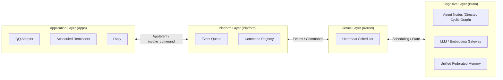

  

<h1 align="center">AuroraBot</h1>

  <a href="README.md">中文</a> | <b>English</b> | <a href="README.ja.md">日本語</a>

  <em>A next-generation internally-driven, autonomous agent framework</em>

  
  
  

---

## What Is She

AuroraBot is a next-generation **internally-driven, autonomous agent framework**.

She is composed of four collaborative layers:

- **Application Layer (Apps)** — Pluggable sensors and actuators connecting to the outside world via a unified PlatformAPI
- **Platform Layer (Platform)** — Manages the runtime host for all apps, responsible for bidirectional communication between layers
- **Kernel Layer (Kernel)** — The management & scheduling core; orchestrates event streams and command flows
- **Cognitive Layer (Brain)** — A file-driven cognitive operating system kernel. Node / Agent / Router node network + Event Bus + Unified LLM Gateway + Unified Federated Memory

> She doesn't "wait for instructions" — she continuously observes, autonomously decides, and proactively acts.

## Four-Layer Architecture

### Highly Decoupled App Plugin System

Each App is an independent sensor and actuator, interacting with the host through a unified `PlatformAPI`. Connecting QQ, timers, file systems, or even external APIs — it only takes one App.

### Directed Cyclic Graph Cognitive Agent Network

Cognition doesn't rely on a single "super agent" — instead, multiple Agent / Router nodes form a directed cyclic graph. Nodes pass state among themselves through a file basket mechanism, forming a continuously running cognitive loop. In the future, cognitive node plugins will be opened for third-party cognitive capability extensions.

### Unified Federated Memory

AuroraBot's memory isn't just about "storing" — it grows structurally. The knowledge graph, vector retrieval, and episodic memory merge into a unified memory layer, ensuring every event and every decision participates in the evolution of memory.

## MCP Adaptation Container (Planned)

We are designing an **MCP (Model Context Protocol) Adaptation Container** that allows any MCP server to connect to AuroraBot as an App.

This means:

- Any tool conforming to the MCP protocol can become an extension of AuroraBot's capabilities
- MCP tools will be automatically mapped into commands callable by the kernel
- The kernel doesn't need to be aware of MCP protocol details — the adaptation container handles it all

> Let the MCP ecosystem become an extension of your capabilities.

## Quick Navigation

For complete architecture design, usage guides, and development documentation, please **[visit the AuroraBot Documentation 📖](https://www.aurorabot.org/)**:

| Document                                                                                 | Description                                                  |
| ---------------------------------------------------------------------------------------- | ------------------------------------------------------------ |
| [Overview](https://www.aurorabot.org/start/overview.html)                                | A quick introduction to AuroraBot's vision & layers          |
| [Getting Started](https://www.aurorabot.org/start/getting-started.html)                  | Run the project from scratch                                 |
| [System Architecture](https://www.aurorabot.org/architecture/system-overview.html)       | Understand the four layers: Apps / Platform / Kernel / Brain |
| [Cognitive Architecture](https://www.aurorabot.org/architecture/brain-architecture.html) | Deep dive into the directed cyclic Agent node network        |
| [Platform Runtime](https://www.aurorabot.org/architecture/platform-runtime.html)         | Understand the runtime relationship between host and Apps    |
| [App Development Guide](https://www.aurorabot.org/develop/app-development.html)          | Develop your own App                                         |
| [AUR CLI](https://www.aurorabot.org/develop/aur-cli.html)                                | App development toolchain                                    |

## Open Source Acknowledgments

AuroraBot is built upon the shoulders of many outstanding open-source projects:

| Project                                           | Description                         | License                                                                             |
| ------------------------------------------------- | ----------------------------------- | :---------------------------------------------------------------------------------- |
| [NoneBot2](https://github.com/nonebot/nonebot2)   | Cross-platform Python bot framework | [MIT License](https://github.com/nonebot/nonebot2/blob/master/LICENSE)              |
| [LiteLLM](https://github.com/BerriAI/litellm)     | Unified LLM API call layer          | [LICENSE](https://github.com/BerriAI/litellm/blob/litellm_internal_staging/LICENSE) |
| [mem0](https://github.com/mem0ai/mem0)            | Agent memory infrastructure         | [Apache License 2.0](https://github.com/mem0ai/mem0/blob/main/LICENSE)              |
| [ChromaDB](https://github.com/chroma-core/chroma) | Open-source vector database         | [Apache License 2.0](https://github.com/chroma-core/chroma/blob/main/LICENSE)       |
| [OneBot](https://github.com/botuniverse/onebot)   | Unified chatbot interface standard  | [MIT License](https://github.com/botuniverse/onebot/blob/main/LICENSE)              |
| [VitePress](https://github.com/vuejs/vitepress)   | Documentation site generator        | [MIT License](https://github.com/vuejs/vitepress/blob/main/LICENSE)                 |

Special thanks to **[MaiBot](https://github.com/MaiM-with-u/MaiBot)** for providing architectural inspiration and design references.

## License

This project is open-sourced under the [Apache License 2.0](./LICENSE).

---

  Built with ❤️ by <a href="https://github.com/JuFireX">JuFireX</a> | <a href="https://github.com/AuroraBot-Dev">AuroraBot-Dev</a>

