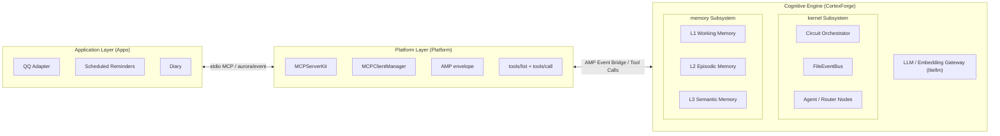

  

<h1 align="center">AuroraBot</h1>

  <a href="README.md">中文</a> | <b>English</b> | <a href="README.ja.md">日本語</a>

  <em>An intrinsically-driven, autonomous decision-making agent framework built on AuroraBot Core + MCP Platform</em>

  File-Driven Cognitive Engine · Three-Tier Unified Memory · Pluggable MCP App Servers

  
  
  
  

---

## What She Is

AuroraBot is a next-generation **intrinsically-driven, autonomous agent framework**. She consists of two runtime layers plus a cognitive engine:

- **Application Layer (Apps)** — Pluggable MCP Server sensors and actuators. Each App declares its capabilities through `manifest.yaml` / `apps/config.yml`
- **Platform Layer (Platform)** — The MCP Host Layer manages local stdio Server lifecycles, Client connections, tools/call, and notification event bridging
- **Cognitive Engine (Brain / CortexForge)** — A file-driven cognitive operating system kernel, composed of two subsystems:
  - **kernel**: `Node` / `Agent` / `Router` node network + `FileEventBus` event bus + `Circuit` orchestrator
  - **memory**: L1 working memory / L2 episodic memory / L3 semantic memory, accessed through `UnifiedMemoryManager`

> She doesn't "wait for instructions" — she continuously observes, autonomously decides, and proactively acts.

## Architecture Overview

### Highly Decoupled App Plugin System

Each App is an independent MCP Server. Connecting QQ, timers, file systems, or external APIs only requires one Server. Apps declare startup commands and tool capabilities through `manifest.yaml` and `apps/config.yml`; the Platform connects, discovers, and calls them uniformly.

### Declarative Cognitive Topology

Cognition doesn't rely on a single "super agent" — instead, multiple `Agent` / `Router` nodes are declaratively configured through `topology.yaml`. Nodes pass state through the `FileEventBus` file event bus, forming a file-driven cognitive pipeline. In the future, cognitive node plugins will be opened for third-party cognitive capability extensions.

### Three-Tier Unified Memory

AuroraBot's memory grows structurally:

| Tier               | Type                | Storage                         | Purpose                       |
| ------------------ | ------------------- | ------------------------------- | ----------------------------- |
| L1 Working Memory  | FIFO in-memory list | Not persisted                   | Current session context       |
| L2 Episodic Memory | JSON file append    | LLM-compressed after 50 entries | Timeline-based archiving      |
| L3 Semantic Memory | ChromaDB vector     | Unlimited                       | Semantic similarity retrieval |

`UnifiedMemoryManager` encapsulates all three tiers behind a unified interface — nodes never need to understand the underlying data flow. Every interaction writes to all three tiers at once, and retrieval merges results across all layers.

## MCP App Server System

AuroraBot's App system has moved to the **MCP (Model Context Protocol)** path, allowing any MCP Server to connect to AuroraBot as an App.

This means:

- Any tool conforming to the MCP protocol can become an extension of AuroraBot's capabilities
- MCP tools are converted into Brain-visible tool descriptions
- Brain executes tools through the MCP Client, while events enter the file-driven pipeline as AMP envelopes

> Let the MCP ecosystem become an extension of your capabilities.

## Quick Navigation

For complete architecture design, usage guides, and development documentation, please **[visit the AuroraBot Documentation 📖](https://www.aurorabot.org/)**:

| Document                                                                                 | Description                                                       |
| ---------------------------------------------------------------------------------------- | ----------------------------------------------------------------- |
| [Overview](https://www.aurorabot.org/start/overview.html)                                | A quick introduction to AuroraBot's vision & architecture         |
| [Getting Started](https://www.aurorabot.org/start/getting-started.html)                  | Run the project from scratch                                      |
| [Configuration](https://www.aurorabot.org/start/configuration.html)                      | Environment variables, platform config, app config & persona docs |
| [System Architecture](https://www.aurorabot.org/architecture/system-overview.html)       | Understand the Apps / Platform / Kernel / Brain layers            |
| [Cognitive Architecture](https://www.aurorabot.org/architecture/brain-architecture.html) | File-driven cognitive pipeline and currently enabled topology     |
| [Node System](https://www.aurorabot.org/architecture/node-system.html)                   | Node / Agent / Router data structures and event bus               |
| [Memory System](https://www.aurorabot.org/architecture/memory-system.html)               | L1 / L2 / L3 three-tier unified memory storage and retrieval      |
| [App Development Guide](https://www.aurorabot.org/develop/app-development.html)          | Develop your own App from structure to lifecycle                  |
| [Brain Node Development](https://www.aurorabot.org/develop/brain-node-development.html)  | Write Agent / Router nodes                                        |
| [AUR CLI](https://www.aurorabot.org/develop/aur-cli.html)                                | Application development toolchain roadmap                         |

## Open Source Acknowledgments

AuroraBot is built upon the shoulders of many outstanding open-source projects:

| Project                                           | Description                         | License                                                                             |
| ------------------------------------------------- | ----------------------------------- | :---------------------------------------------------------------------------------- |
| [LiteLLM](https://github.com/BerriAI/litellm)     | Unified LLM API call layer          | [LICENSE](https://github.com/BerriAI/litellm/blob/litellm_internal_staging/LICENSE) |
| [mem0](https://github.com/mem0ai/mem0)            | Agent memory infrastructure         | [Apache License 2.0](https://github.com/mem0ai/mem0/blob/main/LICENSE)              |
| [ChromaDB](https://github.com/chroma-core/chroma) | Open-source vector database         | [Apache License 2.0](https://github.com/chroma-core/chroma/blob/main/LICENSE)       |
| [VitePress](https://github.com/vuejs/vitepress)   | Documentation site generator        | [MIT License](https://github.com/vuejs/vitepress/blob/main/LICENSE)                 |

Special thanks to **[MaiBot](https://github.com/MaiM-with-u/MaiBot)** for providing architectural inspiration and design references.

## License

This project is open-sourced under the [Apache License 2.0](./LICENSE).

---

## Star History

<a href="https://www.star-history.com/?repos=AuroraBot-Dev%2FAuroraBot&type=date&logscale=&legend=bottom-right">
 <picture>
   <source media="(prefers-color-scheme: dark)" srcset="https://api.star-history.com/chart?repos=AuroraBot-Dev/AuroraBot&type=date&theme=dark&logscale&legend=bottom-right" />
   <source media="(prefers-color-scheme: light)" srcset="https://api.star-history.com/chart?repos=AuroraBot-Dev/AuroraBot&type=date&logscale&legend=bottom-right" />
   
 </picture>
</a>

---

  Built with ❤️ by <a href="https://github.com/JuFireX">JuFireX</a> | <a href="https://github.com/AuroraBot-Dev">AuroraBot-Dev</a>

