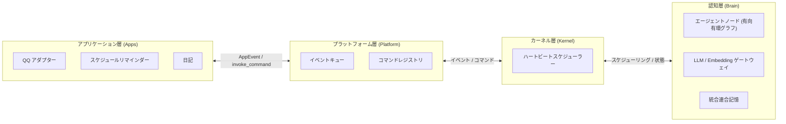

  

<h1 align="center">AuroraBot</h1>

  <a href="README.md">中文</a> | <a href="README.en.md">English</a> | <b>日本語</b>

  <em>次世代の内発的・自律的意思決定エージェントフレームワーク</em>

  
  
  

---

## 彼女について

AuroraBot は、次世代の**内発的・自律的意思決定エージェントフレームワーク**です。

彼女は 4 層の協調コンポーネントで構成されています：

- **アプリケーション層 (Apps)** — 統一された PlatformAPI を通じて外部世界と接続する、プラグ可能なセンサーとアクチュエーター
- **プラットフォーム層 (Platform)** — 全アプリのランタイムホストを管理し、上下層との双方向通信を担う
- **カーネル層 (Kernel)** — 管理・スケジューリングの中核；イベントストリームとコマンドフローを編成
- **認知層 (Brain)** — ファイル駆動の認知 OS カーネル。Node / Agent / Router ノードネットワーク + イベントバス + 統合 LLM ゲートウェイ + 統合連合記憶

> 彼女は「指示を待つ」のではなく、「継続的に観察し、自律的に判断し、能動的に行動する」のです。

## 4 層アーキテクチャ

### 高度に分離された App プラグインシステム

各 App は独立したセンサーとアクチュエーターであり、統一された `PlatformAPI` を通じてホストと連携します。QQ、タイマー、ファイルシステム、さらには外部 API への接続も、たった 1 つの App で実現できます。

### 有向有環グラフの認知エージェントネットワーク

認知は単一の「スーパーエージェント」に依存せず、複数の Agent / Router ノードが有向有環グラフを形成します。ノード間はファイルバスケット機構を通じて状態を受け渡し、継続的に動作する認知ループを形成します。将来的には、サードパーティによる認知能力拡張のための認知ノードプラグインを開放予定です。

### 統合連合記憶

AuroraBot の記憶は単なる「保存」ではなく、**構造的に成長**します。知識グラフ、ベクトル検索、エピソード記憶が統合記憶層に融合し、あらゆるイベントと意思決定が記憶の進化に参加します。

## 計画中の MCP アダプテーションコンテナ

私たちは、任意の MCP サーバーを App として AuroraBot に接続できる **MCP (Model Context Protocol) アダプテーションコンテナ**を設計しています。

これは次のことを意味します：

- MCP プロトコルに準拠するあらゆるツールが AuroraBot の能力拡張になり得る
- MCP ツールは自動的にカーネルから呼び出し可能なコマンドにマッピングされる
- カーネルは MCP プロトコルの詳細を意識する必要がなく、アダプテーションコンテナが統一的に処理する

> MCP エコシステムをあなたの能力拡張に。

## クイックナビゲーション

完全なアーキテクチャ設計、利用ガイド、開発ドキュメントについては、**[AuroraBot ドキュメントサイト 📖](https://www.aurorabot.org/)** をご覧ください：

| ドキュメント                                                                               | 説明                                              |
| ------------------------------------------------------------------------------------------ | ------------------------------------------------- |
| [概要](https://www.aurorabot.org/start/overview.html)                                      | AuroraBot のビジョンと 4 層構造を素早く理解       |
| [クイックスタート](https://www.aurorabot.org/start/getting-started.html)                   | ゼロからプロジェクトを起動                        |
| [システムアーキテクチャ](https://www.aurorabot.org/architecture/system-overview.html)      | Apps / Platform / Kernel / Brain の 4 層を理解    |
| [認知アーキテクチャ](https://www.aurorabot.org/architecture/brain-architecture.html)       | 有向有環グラフの Agent ノードネットワークを深掘り |
| [プラットフォームランタイム](https://www.aurorabot.org/architecture/platform-runtime.html) | ホストと App のランタイム関係を理解               |
| [App 開発ガイド](https://www.aurorabot.org/develop/app-development.html)                   | 独自の App を開発                                 |
| [AUR CLI](https://www.aurorabot.org/develop/aur-cli.html)                                  | アプリ開発ツールチェーン                          |

## オープンソースへの謝辞

AuroraBot は多くの優れたオープンソースプロジェクトの上に構築されています：

| プロジェクト                                      | 説明                                               | ライセンス                                                                          |
| ------------------------------------------------- | -------------------------------------------------- | :---------------------------------------------------------------------------------- |
| [NoneBot2](https://github.com/nonebot/nonebot2)   | クロスプラットフォーム Python ボットフレームワーク | [MIT License](https://github.com/nonebot/nonebot2/blob/master/LICENSE)              |
| [LiteLLM](https://github.com/BerriAI/litellm)     | 統合 LLM API コール層                              | [LICENSE](https://github.com/BerriAI/litellm/blob/litellm_internal_staging/LICENSE) |
| [mem0](https://github.com/mem0ai/mem0)            | エージェント記憶基盤                               | [Apache License 2.0](https://github.com/mem0ai/mem0/blob/main/LICENSE)              |
| [ChromaDB](https://github.com/chroma-core/chroma) | オープンソースベクトルデータベース                 | [Apache License 2.0](https://github.com/chroma-core/chroma/blob/main/LICENSE)       |
| [OneBot](https://github.com/botuniverse/onebot)   | 統一チャットボットインターフェース標準             | [MIT License](https://github.com/botuniverse/onebot/blob/main/LICENSE)              |
| [VitePress](https://github.com/vuejs/vitepress)   | ドキュメントサイトジェネレーター                   | [MIT License](https://github.com/vuejs/vitepress/blob/main/LICENSE)                 |

**[MaiBot](https://github.com/MaiM-with-u/MaiBot)** には、アーキテクチャのインスピレーションと設計参考を提供していただき、特別に感謝いたします。

## ライセンス

本プロジェクトは [Apache License 2.0](./LICENSE) の下でオープンソース公開されています。

---

  Built with ❤️ by <a href="https://github.com/JuFireX">JuFireX</a> | <a href="https://github.com/AuroraBot-Dev">AuroraBot-Dev</a>

