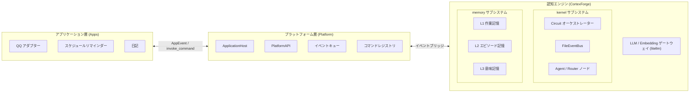

  

<h1 align="center">AuroraBot</h1>

  <a href="README.md">中文</a> | <a href="README.en.md">English</a> | <b>日本語</b>

  <em>NoneBot2 ベースの新世代の内発的・自律的意思決定エージェントフレームワーク</em>

  宣言的認知トポロジー · 三層連合記憶 · 統一 LLM ゲートウェイ

  
  
  

---

## 彼女について

AuroraBot は、次世代の**内発的・自律的意思決定エージェントフレームワーク**です。彼女は 2 つのランタイム層と 1 つの認知エンジンで構成されています：

- **アプリケーション層 (Apps)** — プラグ可能なセンサーとアクチュエーター。各 App は `manifest.yaml` で能力を宣言し、統一された `PlatformAPI` を通じて外部世界と接続
- **プラットフォーム層 (Platform)** — `ApplicationHost` が App の登録、ライフサイクル、イベントキューを管理。`PlatformAPI` が各 App に双方向通信を提供
- **認知エンジン (Brain / CortexForge)** — ファイル駆動の認知 OS カーネル。2 つのサブシステムで構成：
  - **kernel**: `Node` / `Agent` / `Router` ノードネットワーク + `FileEventBus` イベントバス + `Circuit` オーケストレーター
  - **memory**: L1 作業記憶 / L2 エピソード記憶 / L3 意味記憶、`UnifiedMemoryManager` で統一アクセス

> 彼女は「指示を待つ」のではなく、「継続的に観察し、自律的に判断し、能動的に行動する」のです。

## アーキテクチャ概要

### 高度に分離された App プラグインシステム

各 App は独立したセンサーとアクチュエーターです。QQ、タイマー、ファイルシステム、さらには外部 API への接続も、たった 1 つの App で実現できます。App は `manifest.yaml` でコマンドを宣言し、`PlatformAPI` を通じてホストと連携、必要に応じて有効化されます。

### 宣言的認知トポロジー

認知は単一の「スーパーエージェント」に依存せず、複数の `Agent` / `Router` ノードが `topology.yaml` で宣言的に構成されます。ノード間は `FileEventBus` ファイルイベントバスを通じて状態を受け渡し、ファイル駆動の認知パイプラインを形成します。将来的には、サードパーティによる認知能力拡張のための認知ノードプラグインを開放予定です。

### 三層連合記憶

AuroraBot の記憶は**構造的に成長**します：

| 層                | タイプ            | ストレージ         | 用途                           |
| ----------------- | ----------------- | ------------------ | ------------------------------ |
| L1 作業記憶       | FIFO メモリリスト | 永続化なし         | 現在のセッションコンテキスト   |
| L2 エピソード記憶 | JSON ファイル追記 | 50 件後に LLM 圧縮 | タイムラインベースのアーカイブ |
| L3 意味記憶       | ChromaDB ベクトル | 無制限             | 意味的類似度検索               |

`UnifiedMemoryManager` が三層を統一インターフェースでカプセル化し、ノードは基盤のデータフローを意識する必要がありません。すべての対話が三層に一括書き込みされ、検索時には全層から結果をマージします。

## 計画中の MCP アダプテーションコンテナ

私たちは、任意の MCP サーバーを App として AuroraBot に接続できる **MCP (Model Context Protocol) アダプテーションコンテナ**を設計しています。

これは次のことを意味します：

- MCP プロトコルに準拠するあらゆるツールが AuroraBot の能力拡張になり得る
- MCP ツールは自動的にカーネルから呼び出し可能なコマンドにマッピングされる
- カーネルは MCP プロトコルの詳細を意識する必要がなく、アダプテーションコンテナが統一的に処理する

> MCP エコシステムをあなたの能力拡張に。

## クイックナビゲーション

完全なアーキテクチャ設計、利用ガイド、開発ドキュメントについては、**[AuroraBot ドキュメントサイト 📖](https://www.aurorabot.org/)** をご覧ください：

| ドキュメント                                                                          | 説明                                                             |
| ------------------------------------------------------------------------------------- | ---------------------------------------------------------------- |
| [概要](https://www.aurorabot.org/start/overview.html)                                 | AuroraBot のビジョンとアーキテクチャを素早く理解                 |
| [クイックスタート](https://www.aurorabot.org/start/getting-started.html)              | ゼロからプロジェクトを起動                                       |
| [設定](https://www.aurorabot.org/start/configuration.html)                            | 環境変数、プラットフォーム設定、アプリ設定、ペルソナドキュメント |
| [システムアーキテクチャ](https://www.aurorabot.org/architecture/system-overview.html) | Apps / Platform / Kernel / Brain の 4 層を理解                   |
| [認知アーキテクチャ](https://www.aurorabot.org/architecture/brain-architecture.html)  | ファイル駆動の認知パイプラインと現在有効なトポロジー             |
| [ノードシステム](https://www.aurorabot.org/architecture/node-system.html)             | Node / Agent / Router のデータ構造とイベントバス                 |
| [記憶システム](https://www.aurorabot.org/architecture/memory-system.html)             | L1 / L2 / L3 三層連合記憶の保存と検索                            |
| [App 開発ガイド](https://www.aurorabot.org/develop/app-development.html)              | 構造からライフサイクルまで自作 App を開発                        |
| [認知ノード開発](https://www.aurorabot.org/develop/brain-node-development.html)       | Agent / Router ノードを作成する                                  |
| [AUR CLI](https://www.aurorabot.org/develop/aur-cli.html)                             | アプリ開発ツールチェーンロードマップ                             |

## オープンソースへの謝辞

AuroraBot は多くの優れたオープンソースプロジェクトの上に構築されています：

| プロジェクト                                      | 説明                                               | ライセンス                                                                          |
| ------------------------------------------------- | -------------------------------------------------- | :---------------------------------------------------------------------------------- |
| [NoneBot2](https://github.com/nonebot/nonebot2)   | クロスプラットフォーム Python ボットフレームワーク | [MIT License](https://github.com/nonebot/nonebot2/blob/master/LICENSE)              |
| [LiteLLM](https://github.com/BerriAI/litellm)     | 統合 LLM API コール層                              | [LICENSE](https://github.com/BerriAI/litellm/blob/litellm_internal_staging/LICENSE) |
| [mem0](https://github.com/mem0ai/mem0)            | エージェント記憶基盤                               | [Apache License 2.0](https://github.com/mem0ai/mem0/blob/main/LICENSE)              |
| [ChromaDB](https://github.com/chroma-core/chroma) | オープンソースベクトルデータベース                 | [Apache License 2.0](https://github.com/chroma-core/chroma/blob/main/LICENSE)       |
| [OneBot](https://github.com/botuniverse/onebot)   | 統一チャットボットインターフェース標準             | [MIT License](https://github.com/botuniverse/onebot/blob/main/LICENSE)              |
| [VitePress](https://github.com/vuejs/vitepress)   | ドキュメントサイトジェネレーター                   | [MIT License](https://github.com/vuejs/vitepress/blob/main/LICENSE)                 |

**[MaiBot](https://github.com/MaiM-with-u/MaiBot)** には、アーキテクチャのインスピレーションと設計参考を提供していただき、特別に感謝いたします。

## ライセンス

本プロジェクトは [Apache License 2.0](./LICENSE) の下でオープンソース公開されています。

---

  Built with ❤️ by <a href="https://github.com/JuFireX">JuFireX</a> | <a href="https://github.com/AuroraBot-Dev">AuroraBot-Dev</a>

