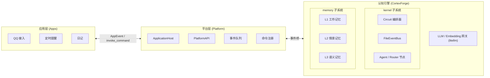

  

<h1 align="center">AuroraBot</h1>

  <b>中文</b> | <a href="README.en.md">English</a> | <a href="README.ja.md">日本語</a>

  <em>基于 NoneBot2 的新一代内驱式、自主决策的智能体框架</em>

  声明式认知拓扑 · 三级联合记忆 · 统一 LLM 网关

  
  
  

---

## 她是什么

AuroraBot 是新一代**内驱式、自主决策的智能体框架**。她由两层运行时 + 一个认知引擎构成：

- **应用层 (Apps)** — 可插拔的感知器与执行器，每个 App 通过 `manifest.yaml` 声明能力，通过统一 `PlatformAPI` 接入外部世界
- **平台层 (Platform)** — `ApplicationHost` 统一管理 App 的注册、生命周期与事件队列，`PlatformAPI` 向 App 提供双向通信能力
- **认知引擎 (Brain / CortexForge)** — 文件驱动认知操作系统内核，包含两个子系统：
  - **kernel**：`Node` / `Agent` / `Router` 节点网络 + `FileEventBus` 事件总线 + `Circuit` 编排器
  - **memory**：L1 工作记忆 / L2 情景记忆 / L3 语义记忆，通过 `UnifiedMemoryManager` 统一存取

> 她不是在"等待指令"，而是在"持续观察、自主决策、主动行动"。

## 架构概览

### 高度解耦的 App 插件体系

每个 App 都是独立的感知器与执行器。接入 QQ、定时器、文件系统、甚至外部 API——都只需要一个 App。App 通过 `manifest.yaml` 声明命令，通过 `PlatformAPI` 与宿主交互，按需启用。

### 声明式认知拓扑

认知不依赖单一"超级 Agent"，而是由多个 `Agent` / `Router` 节点通过 `topology.yaml` 声明式配置邻接关系。节点之间通过 `FileEventBus` 文件事件总线传递状态，形成文件驱动的认知管道。未来开放认知节点插件，供第三方扩展认知能力。

### 三级联合记忆

AuroraBot 的记忆是**结构化地生长**的：

| 层级        | 类型          | 存储             | 用途           |
| ----------- | ------------- | ---------------- | -------------- |
| L1 工作记忆 | FIFO 内存列表 | 不持久化         | 当前会话上下文 |
| L2 情景记忆 | JSON 文件追加 | 50 条后 LLM 压缩 | 按时间线存档   |
| L3 语义记忆 | ChromaDB 向量 | 无上限           | 语义相似度检索 |

`UnifiedMemoryManager` 封装三层统一入口，节点无需关心底层流转。每次交互一键写入三层，检索时合并返回。

## 计划中的 MCP 适配容器

我们正在设计一个 **MCP (Model Context Protocol) 适配容器**，让任意 MCP 服务器以 App 形态接入 AuroraBot。

这意味着：

- 任何遵循 MCP 协议的工具都可以成为 AuroraBot 的能力延伸
- MCP 工具会被自动映射为内核可调用的命令
- 内核无需感知 MCP 协议细节，由适配容器统一处理

> 让 MCP 生态成为你的能力延伸。

## 快速导航

完整的架构设计、使用指南与开发文档请 **[访问 AuroraBot 文档站 📖](https://www.aurorabot.org/)**：

| 文档                                                                           | 说明                                       |
| ------------------------------------------------------------------------------ | ------------------------------------------ |
| [项目总览](https://www.aurorabot.org/start/overview.html)                      | 快速了解 AuroraBot 的定位与架构            |
| [快速开始](https://www.aurorabot.org/start/getting-started.html)               | 从零把项目跑起来                           |
| [配置说明](https://www.aurorabot.org/start/configuration.html)                 | 环境变量、平台配置、应用配置与人格文档     |
| [架构总览](https://www.aurorabot.org/architecture/system-overview.html)        | 理解 Apps / Platform / Kernel / Brain 四层 |
| [认知引擎架构](https://www.aurorabot.org/architecture/brain-architecture.html) | 文件驱动认知管道与当前启用的认知管线       |
| [节点系统](https://www.aurorabot.org/architecture/node-system.html)            | Node / Agent / Router 数据结构与事件总线   |
| [记忆系统](https://www.aurorabot.org/architecture/memory-system.html)          | L1 / L2 / L3 三级联合记忆的存储与检索      |
| [App 开发指南](https://www.aurorabot.org/develop/app-development.html)         | 从目录结构到生命周期开发 App               |
| [认知节点开发](https://www.aurorabot.org/develop/brain-node-development.html)  | 编写 Agent / Router 节点                   |
| [AUR CLI](https://www.aurorabot.org/develop/aur-cli.html)                      | 应用开发工具链路线图                       |

## 开源致谢

AuroraBot 站在众多优秀开源项目的肩膀上构建：

| 项目                                              | 说明                     | 开源协议                                                                            |
| ------------------------------------------------- | ------------------------ | :---------------------------------------------------------------------------------- |
| [NoneBot2](https://github.com/nonebot/nonebot2)   | 跨平台 Python 机器人框架 | [MIT License](https://github.com/nonebot/nonebot2/blob/master/LICENSE)              |
| [LiteLLM](https://github.com/BerriAI/litellm)     | 统一 LLM API 调用层      | [LICENSE](https://github.com/BerriAI/litellm/blob/litellm_internal_staging/LICENSE) |
| [mem0](https://github.com/mem0ai/mem0)            | 智能体记忆基础设施       | [Apache License 2.0](https://github.com/mem0ai/mem0/blob/main/LICENSE)              |
| [ChromaDB](https://github.com/chroma-core/chroma) | 开源向量数据库           | [Apache License 2.0](https://github.com/chroma-core/chroma/blob/main/LICENSE)       |
| [OneBot](https://github.com/botuniverse/onebot)   | 统一聊天机器人接口标准   | [MIT License](https://github.com/botuniverse/onebot/blob/main/LICENSE)              |
| [VitePress](https://github.com/vuejs/vitepress)   | 文档站生成框架           | [MIT License](https://github.com/vuejs/vitepress/blob/main/LICENSE)                 |

特别感谢 **[MaiBot](https://github.com/MaiM-with-u/MaiBot)** 为本项目提供架构灵感与设计参考。

## 许可证

本项目使用 [Apache License 2.0](./LICENSE) 协议开源。

---

## Star History

<a href="https://www.star-history.com/?repos=AuroraBot-Dev%2FAuroraBot&type=date&logscale=&legend=bottom-right">
 <picture>
   <source media="(prefers-color-scheme: dark)" srcset="https://api.star-history.com/chart?repos=AuroraBot-Dev/AuroraBot&type=date&theme=dark&logscale&legend=bottom-right" />
   <source media="(prefers-color-scheme: light)" srcset="https://api.star-history.com/chart?repos=AuroraBot-Dev/AuroraBot&type=date&logscale&legend=bottom-right" />
   
 </picture>
</a>

---

  Built with ❤️ by <a href="https://github.com/JuFireX">JuFireX</a> | <a href="https://github.com/AuroraBot-Dev">AuroraBot-Dev</a>

