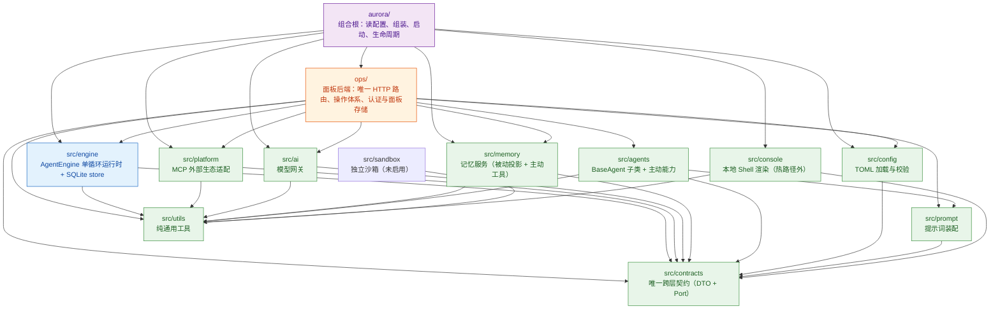

# AuroraBot 技术解析——架构、数据流转与子包模式

> 本文件是项目的完整技术解析：架构全景、每个子包的架构模式、运行时数据流转、
> 持久化机制、工具域划分与演化指南。**持续与实现保持同步**。
>
> 唯一设计基准：[RFC 0300](rfc/0300-unified-architecture-and-contracts.md)；本文档与其冲突时以 RFC 为准。

---

## 1. 系统总览

AuroraBot 是一个以 **Agent 为中心**的自主智能体框架。核心哲学：

- **一条认知闭环**：`输入 → 防抖聚合 → 注意力初筛 → 本体意识委派 → 决策 → 模型/工具 → 记忆投影`。
- **Agent 全同构**：一切 Agent（triage / root / worker / memory）都由三元组实例化——
  ① 上下文（AgentContext）② 工具权限域（profile.capabilities）③ 逻辑实现类（BaseAgent 子类）。
- **单一存储**：SQLite WAL 是运行态与终态的唯一权威，无 JSON 归档、无 JSONL 会话日志（RFC 0300）。
- **单进程无租约**：一个事件循环独占，无 CAS/租约/线程池（RFC 0300）。
- **能力统一**：所有执行效果（记忆写入、平台动作、模型调用）都是注入的 Port 或 ToolExecutor。

当前规模：`src/` + `aurora/` 约 40 个源文件、~6800 行（其中 engine 核心 ~2600 行）。

---

## 2. 分层架构全景

### 2.1 依赖关系图



### 2.2 五层角色（RFC 0300 重定性）

| 层       | 包                                         | 角色                                   | 关键约束                             |
| -------- | ------------------------------------------ | -------------------------------------- | ------------------------------------ |
| 启动环境 | `aurora`                                   | 进程"大前期"：配置快照、组合、生命周期 | 唯一认识所有包的层                   |
| 基础建设 | `contracts`/`config`/`ai`/`prompt`/`utils` | 稳定接口与装配物                       | 无业务状态                           |
| 能力     | `memory`/`sandbox`                         | Agent 可主动/被动调用的工具            | 实现 `ToolExecutor` 或 `MemoryStore` |
| 外部接入 | `platform`/`apps`                          | 外部生态兼容层                         | 实现 `ToolExecutor` + `submit_amp`   |
| 运行实现 | `engine`                                   | Agent 运行：状态/闭环/资源边界         | 只依赖 contracts + utils             |

### 2.3 依赖铁律

- `engine` 不 import `ai/platform/memory/agents/config/prompt/ops`——外部服务全部通过**构造参数注入**（`model_provider=`、`memory_store=`、`bind_tool_executors()`）。
- `agents` 不 import engine/memory/platform——handler 只读 `AgentContext`、只返回 `AgentDecision`；主动能力只生成 `ToolRequest`。
- `platform` 只 import contracts + utils。
- `ops` 是唯一可自由 import 所有包的监察 sidecar，但**不在热路径**：engine 不依赖它。
- `src/` 一律不 import `aurora/`。

---

## 3. 核心认知闭环：一条消息的一生

```
用户输入
  │
  ▼
① 平台（Console/Panel/MCP）→ engine.submit_amp(AMP)
  │     AMP = {header.message_id, payload.{type, session_id, summary, data}}
  │     （RFC 0300：无文件投递箱，全部直连 SQLite）
  ▼
② store.enqueue_inbox（store/inbox.py）
  │     幂等检查（causal_events 已有 ingress.received 则忽略）
  │     写入 inbox_events（PENDING），并刷新同会话防抖窗口
  ▼
③ engine.pump() 每轮六步（runtime.py:188）
  │  a. ToolRegistry.recover_pending()   恢复挂起的工具请求
  │  b. （无 ingest 步骤：摄入已在 submit_amp 完成）
  │  c. _triage_inbox()                  到期批次 → 每个批次创建 1 个 Task + 1 个入口 triage agent
  │  d. _pump_turns()                    claim 消息 → handler → apply_decision
  │  e. 派发 model/tool 活动（async 后台）
  │  f. _project_memory()                终态任务 → 记忆投影（to_thread）
  ▼
④ 一条消息的 turn（_pump_turns 内，runtime.py:229）
  │  store.claim_message()        原子领取 1 条 PENDING 消息（无租约，单进程独占）
  │  handle_claim()               组装只读 AgentContext（含记忆快照、权限域过滤后的工具定义）
  │  BaseAgent.handle(context)    返回 AgentDecision（8 种 transition 之一）
  │  apply_authorized_decision()  权限校验（角色/工具/委派/triage_control）
  │  store.apply_decision()       8 分支状态机，单事务原子落库
  ▼
⑤ 决策的 8 种结局（store/decisions.py:125）
  │  model_request  → PENDING model 活动 → 后台 provider.complete → model.completed 消息
  │  tool_request   → PENDING tool 活动 → ToolRegistry → 平台 executor → tool.{status} 回执
  │  delegations    → 子 agent + agent.assigned 消息（入口 agent 附批次投影 context_events）
  │  completion     → agent COMPLETED；根 agent 完成 → Task 终态
  │  wait           → 等待子 agent 回报（派生语义，无持久化等待状态）
  │  defer / discard→ 仅入口 triage agent；结算批次（DEFERRED / 删除）
  │  failure        → agent FAILED；根失败 → Task ERROR
  ▼
⑥ 终态：Task 留在 SQLite（终态即归档）
  │  记忆投影：root_summary + root 最后摘要 → MemoryService（独立 SQLite）
  │  causal_events 完整记录：task.started → agent.{kind} → tool.{status}
  ▼
⑦ 查询：/task /agent /status /output_stream → store 只读投影（debug.py）
```

### 3.1 防抖与批次（RFC 0300）

- 同 `session_id` 的新事件刷新 quiet 窗口（`quiet_seconds`），但不超过首条事件的 max wait（`max_wait_seconds`）。
- 到期后 `claim_triage_batches` 按会话聚合为 `TriageBatch`（有字符上界，单条超大事件截断）。
- 批次被标记 TRIAGING，创建入口 Task（`create_triage_task`）：Task ACTIVE + triage agent（depth 0）+ `task.started` 消息（payload = `{batch: {...}}` 投影）。
- **批次原始事件保留在 inbox_events**，由 triage 的决策结算（委派→删除、defer→DEFERRED、discard→删除、失败→删除、直接完成→删除）。

### 3.2 委派链（RFC 0300）

```
triage agent (depth 0, 无工具, 快模型)
  └─ process → 委派 root（depth 1，收 assignment + context_events 批次投影 + 记忆）
       └─ root（本体意识，全工具域）可继续委派 worker / memory
            ├─ worker（同构子 agent，只收 assignment + 记忆 + 自己的结果）
            └─ memory（唯一获权 aurora.memory.remember 的 agent）
```

- 委派授权：`profile.can_delegate` + `child_profiles` 成员 + 深度/数量预算（store 事务内校验）。
- 等待语义：`wait_for_children` 由数据库事实派生（非终态 children 或 pending child reports），无持久化状态。
- 子 agent 回报：`child.completed` / `child.failed` 消息 → 父 agent 下一轮处理。

### 3.3 模型与工具回执

| 环节         | 入口                                            | 出口                                                    |
| ------------ | ----------------------------------------------- | ------------------------------------------------------- |
| 模型         | `_dispatch_models` claim PENDING model 活动     | `model_provider.complete()` → `complete_model_activity` |
| 模型失败     | provider 异常 / 进程中断                        | `model.failed` 消息（含 error）                         |
| 工具         | `claim_tool_requests` → ToolRegistry 分派       | `binding.executor.execute_tool()` → `complete_tool`     |
| 工具回执     | `complete_tool_activity`（幂等键 = request_id） | `tool.succeeded/failed/unknown` 消息                    |
| 工具完成语义 | `complete_task=True` 且成功                     | **存储层直接完成 agent**（不投递消息，RFC 0300）        |

- 模型活动：`complete_model_activity` 把 `ModelResult` 展开到消息 payload 顶层（`{activity_id, ...result}`）。
- 工具幂等：`causal_events` 中已存在 `(correlation_id=request_id, type=tool.{status})` 则忽略重放。

### 3.4 崩溃恢复（无租约版，RFC 0300）

启动时 `store.initialize()` → `recover_interrupted()` 做一件事：

- `messages`: PROCESSING → PENDING（消息可重新领取）
- `inbox_events`: TRIAGING → PENDING（批次可重新聚合）
- `activities`: model PROCESSING → ERROR 并投递 `model.failed`（agent 收到"interrupted_by_restart"）；tool PROCESSING 保留待恢复

---

## 4. 子包架构模式详解

### 4.1 `src/contracts` — 契约层（最底层，零依赖）

**模式**：纯数据契约 + Port Protocol，全部 `@dataclass(frozen=True, slots=True)`。

| 文件               | 内容                                                                                                                                                                                                                  |
| ------------------ | --------------------------------------------------------------------------------------------------------------------------------------------------------------------------------------------------------------------- |
| `agent.py`         | Agent 状态机核心：`AgentContext`/`AgentDecision`（8 transition + 载荷）/`AgentProfile`（含 `triage_control`）/`TaskState`/`AgentInstance`/`AgentMessage`/`AgentLimits`/`DelegationRequest`/`ToolRequest`/`Completion` |
| `amp.py`           | 外部事件信封 `AmpEnvelope` + `new_amp` 工厂                                                                                                                                                                           |
| `model.py`         | `ModelRequest`/`ModelResult`/`ModelMessage`/`ModelContinuation`/`ModelProvider` Protocol                                                                                                                              |
| `tool.py`          | `ToolExecutor`/`ToolOutcome`/`ToolExecutorBinding` + `MEMORY_REMEMBER_CAPABILITY` 线缆契约                                                                                                                            |
| `memory.py`        | `MemoryStore` Protocol + `MemoryEntry`/`MemoryQuery`/`MemoryContextSnapshot`                                                                                                                                          |
| `triage.py`        | `TriageBatch`/`InboxEvent`/`TriageLimits`（决策类型已删，RFC 0300）                                                                                                                                                   |
| `event.py`         | `RuntimeInput`/`CommandResult`/`OutputStream*`                                                                                                                                                                        |
| `ports.py`         | `InteractiveInputPort`/`ToolQueuePort`/`ToolCompletionPort`/`ExternalAmpIngressPort` 等                                                                                                                               |
| `platform.py`      | 平台生命周期协议 `PlatformHandle`/`PlatformFactory`/`PlatformServer`                                                                                                                                                  |
| `configuration.py` | `AuroraConfig` 及各配置片段 DTO                                                                                                                                                                                       |

**关键认知**：`AgentDecision` 是唯一"决策语言"——任何 Agent（包括 triage）的输出都是它；`contracts` 里没有实现，只有形状。

### 4.2 `src/utils` — 工具层（零依赖）

| 文件               | 内容                                                                   |
| ------------------ | ---------------------------------------------------------------------- |
| `logging.py`       | `get_logger("aurora.<module>")` 统一日志工厂                           |
| `serialization.py` | `extract_json_from_text`/`atomic_write_json`（先写临时文件再原子改名） |
| `time.py`          | `utc_now` 等时间工具                                                   |
| `uvicorn.py`       | `SignalSafeServer`（禁用信号捕获的 uvicorn 包装）                      |

### 4.3 `src/config` — 配置层（只依赖 contracts）

**模式**：启动时一次加载 → 不可变快照 → `get()` 零参数获取；变更靠重启生效（RFC 0300）。

| 文件          | 内容                                                                                       |
| ------------- | ------------------------------------------------------------------------------------------ |
| `loader.py`   | 按包加载所有 `config/*.toml` + profile 覆盖（仅 runtime），合并为单一不可变 `AuroraConfig` |
| `sections.py` | 各 TOML 节的严格解析与校验（键集合精确匹配、`triage_control` 可选、`!` 排除语义校验）      |
| `prompts.py`  | prompts.toml 与 Markdown 片段内容快照（agent 映射必须精确匹配 profiles）                   |
| `files.py`    | TOML/Markdown 读取与 SHA-256 来源快照                                                      |
| `registry.py` | 注册中心 `init(root, profile)` / `get()`                                                   |

**配置分布**（一包一文件）：`runtime`/`engine`/`models`/`platforms`/`agents`/`apps`/`prompts`/`logging`/`storage`。密钥仅来自环境变量。

### 4.4 `src/prompt` — 提示词层（只依赖 contracts）

**模式**：`PromptCatalog`（不可变片段集合）→ `PromptComposer`（从 AgentContext 装配三条消息）。

- 一次模型调用最多三类消息：① stable system（soul/world/agent_profile）② memory system（会话摘要 + 相关长期事实，非空才存在）③ user（当前消息）。
- `_message_text` 按消息类型渲染：`task.started` 的 `{batch}` 投影、`agent.assigned` 的 `context_events`、`tool.*` 回执、`child.*` 子代理回报。
- 所有外部数据经 `_external()` 转义，防止提示词注入。

### 4.5 `src/ai` — 模型层（总分结构，RFC 0300）

**模式**：总控 + 预设角色 + 协议通道三层。

| 层       | 文件                                      | 内容                                                                                                                                                                                |
| -------- | ----------------------------------------- | ----------------------------------------------------------------------------------------------------------------------------------------------------------------------------------- |
| 总控     | `gateway.py`                              | `ModelGatewayService`：能力协商、角色路由、输出规范化、成本预算、冷启动                                                                                                             |
| 预设角色 | `roles/`                                  | `fast`/`quality`/`multimodal`：每个角色文件**自包含完整实现**（RFC 0300）；`base.py` 提供共享纯函数（工具序列化/请求组装/ChatCaller/响应解析）；注册表 `ROLE_PRESETS` + `resolve()` |
| 基础设施 | `models.py`/`providers.py`/`execution.py` | models.dev 缓存/Provider 注册/`TaskManager`/`CostTracker`                                                                                                                           |

**关键语义（RFC 0300）**：统一 `chat_completions` 单通道；基础能力由 models.dev 自动派生，协商只做子集校验与结构化输出二选一；`endpoint` 归代码，`models.toml` 只配置 model 绑定。**角色自包含**：无共享通道类，每个角色文件有自己的 `complete` 实现，多样化改造（如 multimodal 的音频输出处理）只改对应角色文件；共享逻辑以纯函数复用。

**外部接口（RFC 0300）**：

- `get_response(role, inputs)`：脱壳输出——chat 角色返回 `{text, tool_calls, finish_reason}`，embedding 角色返回 `{embeddings, model}`；
- 四类基础角色：快速 / 质量 / 多模态 / **词嵌入**（`EmbeddingRole`，`litellm.aembedding`）；
- `modalities_for(role)`：模型输入/输出模态查询（models.dev）；
- `cost_tracker`：`total_cost()` / `by_role()` / `by_model()` / `by_status()`；
- `export_openai_client()`：导出 `litellm.OpenAI` 兼容 client（mem0 等库使用）。

### 4.6 `src/engine` — 运行实现层（核心，只依赖 contracts + utils）

**模式**：单进程 asyncio 独占、单一 SQLite v10、无租约无乐观锁（RFC 0300）。

```
engine/
  runtime.py       # AgentEngine（459 行）——唯一编排者：pump 六步 + 模型/工具派发 + 记忆投影
  authorize.py     # 纯函数：handle_claim（组装 AgentContext）+ 授权校验（角色/工具/委派/triage_control）
  ingress.py       # 纯函数：AMP 文件摄入、幂等回执、文件分类归档
  debug.py         # 只读投影：task_detail / agent_detail / 旧工作区拒绝
  tool_registry.py # ToolRegistry——按 capability ID 分派执行器的唯一执行表
  store/
    __init__.py    # SQLiteRuntimeStore = StoreDecisionsMixin + StoreInboxMixin + StoreRuntimeMixin
    schema.py      # DDL v9：tasks/agents/messages/activities/causal_events/inbox_events
    base.py        # 连接/事务（BEGIN IMMEDIATE）/行映射/崩溃恢复/insert helpers
    decisions.py   # apply_decision 8 分支状态机 + 消息/活动队列 + 工具回执幂等 + _end_task
    inbox.py       # 摄入/防抖/批次/入口 triage Task/批次结算
    runtime.py     # 只读查询：tasks/agents/messages/events/outputs/counts
    status.py      # 状态字面量常量
```

**AgentEngine 的职责边界**：

- **做**：编排 pump、派发模型/工具、记忆投影、查询代理。
- **不做**：认知决策（交给 handler）、外部 I/O（交给注入的 Port/Executor）、持久化细节（交给 store）。

**一个事务边界**：`apply_decision` 是唯一写入口——每条决策 + 其出站消息 + 因果事件在单事务内原子完成。队列 claim 也是单事务原子 UPDATE（无竞争）。

### 4.7 `src/agents` — 认知层

**模式**：逻辑同构代码化——`BaseAgent` 基类（RFC 0300）。

| 文件            | 内容                                                                                                                                                                                     |
| --------------- | ---------------------------------------------------------------------------------------------------------------------------------------------------------------------------------------- |
| `base.py`       | `BaseAgent`：composer 装配、`_request_model`（tools/output_schema/continuation 可选）、工具定义收集与唯一性检查、决策工厂（`_delegate`/`_complete`/`_fail`/`_wait`/`_defer`/`_discard`） |
| `handler.py`    | `ToolAgent(BaseAgent)`：可恢复工具链状态机（模型响应中的多个 tool call 按序执行，恢复信息存 agent state）                                                                                |
| `triage.py`     | `TriageAgent(BaseAgent)`：注意力初筛——结构化输出（无工具、快模型）、fail-open 委派                                                                                                       |
| `capabilities/` | 主动能力：`delegate`/`wait`/`speech`/`memory`——模型可见的工具前端，只生成 `ToolRequest`                                                                                                  |

**Agent 三元组**（RFC 0300）：`AgentProfile`（agents.toml）= ① implementation（逻辑类）② capabilities（权限域）③ model_role（模型角色）；上下文由 `handle_claim` 构造。

**工具定义去重规则**：平台/记忆工具的定义由 catalog descriptor 单一提供（`handle_claim` 注入）；in-handler capabilities（delegate 等）自行追加；重复 ID 抛错。

### 4.8 `src/memory` — 记忆层（能力，双面）

**模式**：单一 `MemoryService`（memory.sqlite3）既是被动投影的目标，也是主动工具的存储（同源，RFC 0300）。

| 文件          | 内容                                                                                                       |
| ------------- | ---------------------------------------------------------------------------------------------------------- |
| `service.py`  | `MemoryStore` 实现：session_memory（有界滚动摘要）+ durable_facts（去重长期事实）+ memory_receipts（幂等） |
| `executor.py` | `MemoryToolExecutor`：`aurora.memory.remember` 的执行器，scope=session_id，幂等键=request_id               |

**三条写入路径，同一存储**：

1. 终态投影（engine `_project_memory` → `completed_memory_entries`，被动）
2. Triage `memory_candidates`（随终态投影携带）
3. 记忆 agent 主动写入（委派 → ToolRequest → ToolRegistry → MemoryToolExecutor）

### 4.9 `src/platform` — 外部接入层

**模式**：每个平台 = `ToolExecutor`（工具执行）+ 可选 `submit_amp`（事件摄入）+ `PlatformHandle`（生命周期描述）。

| 文件    | 内容                                                                                                                                                                        |
| ------- | --------------------------------------------------------------------------------------------------------------------------------------------------------------------------- |
| `mcp/`  | MCP 协议平台：`adapter.py`（Tool 发现 → capability ID = `{app.package}.{tool}`）、`client_manager.py`（stdio/HTTP 连接）、`server_kit.py`（本地 stdio MCP server 生命周期） |
| `apps/` | 内建 MCP 应用（clock 等），由 platform/mcp 运行，数据在 `data/platform/mcp/apps`                                                                                            |

**每个平台的统一协议**（`contracts/platform.py`）：`PlatformFactory._create(config, runtime) → PlatformHandle{bindings, server, background, cleanup}`；`aurora/runtime.py` 遍历注册表创建、收集绑定、统一启动/停止。

### 4.10 `ops/` — 面板后端（热路径外）

**模式**：可 import 一切的 sidecar，只查不改。

| 文件                      | 内容                                                                                                |
| ------------------------- | --------------------------------------------------------------------------------------------------- |
| `runtime.py`              | `AuroraRuntime`——组合根 light wrapper，实现 `InteractiveInputPort`（route_input）、持有 engine 引用 |
| `router.py`/`registry.py` | `/` 前缀命令路由与目录                                                                              |
| `commands/`               | `/status` `/pump` `/say` `/event` `/task` `/agent` `/clear` `/log` `/quit` `/help`                  |
| `api.py`                  | `/v1/debug/*` FastAPI 调试端点                                                                      |

**平台 ↔ ops 解耦**：平台通过 `InteractiveInputPort` 注入调用，不 import ops。

### 4.11 `src/console` — 本地前端（热路径外）

只读渲染器：按游标轮询 `RuntimeQueryPort.output_stream()` 打印 `Bot> <text>`；非 headless 且 `runtime.console.enabled` 时启动。

### 4.12 `src/sandbox` — 独立沙箱（未启用）

只依赖 utils；代码执行/安全检查/路径隔离；当前运行时不启用（保留组件）。

### 4.13 `aurora` — 组合根

**模式**：唯一进程入口，一次性组装。

| 文件                    | 内容                                                                                                                                  |
| ----------------------- | ------------------------------------------------------------------------------------------------------------------------------------- |
| `main.py`/`registry.py` | CLI 子命令分发                                                                                                                        |
| `runtime.py`            | `run_runtime()`：加载配置 → 构造 ModelGateway/MemoryService/ToolRegistry → 加载 handlers → 构造 AgentEngine → 平台注册表启动 → 主循环 |
| `commands/`             | `check`（代码检查）、`donk`（版本）、`start`（启动）                                                                                  |

**组装顺序**（aurora/runtime.py）：

```
配置快照 → 记忆服务 → 平台注册 → capabilities → handlers(按 profile)
→ AgentEngine(model_provider=, memory_store=) → bind_tool_executors(平台绑定 + 记忆绑定)
→ AuroraRuntime(engine) → 平台启动 → run_forever
```

---

## 5. 运行时数据流转详表

### 5.1 每轮 pump 的读写

| 步骤            | 读                               | 写                                                  |
| --------------- | -------------------------------- | --------------------------------------------------- |
| recover_pending | activities(tool PROCESSING)      | 恢复回执                                            |
| triage          | inbox_events(到期批次)           | TRIAGING → Task + agent + task.started              |
| expire_tasks    | tasks(ACTIVE)                    | 超时 → BUDGET_EXHAUSTED                             |
| turns           | messages(PENDING)                | PROCESSING → COMPLETED/ERROR；agent/activity/causal |
| execute_pending | activities(tool PENDING)         | PROCESSING → 回执 → tool.{status} 消息              |
| model dispatch  | activities(model PENDING)        | PROCESSING → COMPLETED/ERROR → model.{status} 消息  |
| memory 投影     | tasks(COMPLETED) + causal_events | MemoryService（独立库）                             |

### 5.2 消息状态机（messages 表）

```
PENDING ──claim──▶ PROCESSING ──apply_decision──▶ COMPLETED
   │                    │
   └────fail_message────┴──▶ ERROR
```

### 5.3 任务状态机（tasks 表）

```
ACTIVE ──根完成──▶ COMPLETED / SILENT
   │     ──defer──▶ CANCELLED (triage.defer)
   │     ──discard─▶ CANCELLED (triage.discard)
   │     ──预算──▶ BUDGET_EXHAUSTED
   │     ──根失败─▶ ERROR
   │     ──/cancel─▶ CANCELLED
```

### 5.4 Agent 状态机（agents 表）

```
READY ──claim──▶ (处理中，无持久化中间态)
  ├── completion ──▶ COMPLETED
  ├── failure ──▶ FAILED
  ├── 任务被终止 ──▶ CANCELLED
  └── 其他决策 ──▶ READY（等待语义由 activities/children 派生，RFC 0300）
```

---

## 6. 持久化机制

### 6.1 载体与位置

| 载体       | 路径                          | 内容                       | 写入者                 |
| ---------- | ----------------------------- | -------------------------- | ---------------------- |
| SQLite WAL | `data/engine/runtime.sqlite3` | 运行态 + 终态（唯一权威）  | engine store           |
| SQLite WAL | `data/memory/memory.sqlite3`  | 会话摘要/长期事实/幂等回执 | MemoryService          |
| SQLite WAL | `data/ops/panel.sqlite3`      | 面板会话/附件索引          | PanelStore（RFC 0300） |

### 6.2 何时落库（决策驱动）

- **所有状态变更都发生在 `apply_decision` 单事务内**——没有散落的写库逻辑。
- 模型/工具回执：`complete_model_activity` / `complete_tool_activity` 各一个事务。
- 摄入：`enqueue_inbox` 一个事务（含幂等与防抖窗口刷新）。
- 队列 claim：`claim_message` / `claim_activities` 单事务原子 UPDATE。

### 6.3 WAL 说明

WAL（Write-Ahead Logging）是 SQLite 的并发模式：写先追加到 `-wal` 文件，checkpoint 时合并进主库。**它不是独立存储**——读写一致；engine 单写者，无并发冲突。崩溃时 WAL 自动重放。

---

## 7. 工具域划分

### 7.1 工具域命名（RFC 0300：一律 `aur.*`）

| 域         | 格式                           | 示例                                                         |
| ---------- | ------------------------------ | ------------------------------------------------------------ |
| 平台 MCP   | `aur.mcp.<app_package>.<tool>` | `aur.mcp.org.aurora.clock.get_time`                          |
| 平台 MCP   | `aur.mcp.<app_package>.<tool>` | `aur.mcp.org.aurora.clock.get_time`                          |
| 服务       | `aur.serv.<服务名>.<方法>`     | `aur.serv.memory.remember`                                   |
| Agent 内建 | `aur.agent.<方法>`             | `aur.agent.delegate` / `aur.agent.wait` / `aur.agent.speech` |

所有工具汇入 `ToolRegistry`（capability ID → executor 的一对一路由表）；catalog descriptor 是授权与参数校验的唯一依据。

### 7.1b 回执通道（RFC 0300：结果 = AMP）

```
engine → ToolRegistry → executor.execute_tool(request)（无返回值）
                              │ 执行完成
                              ▼
executor → tool_receipt_amp() → submit_amp(tool.{status}) → engine 幂等消费
                              │（request_id 幂等键）
                              ▼
store.consume_tool_receipt → 完成活动 → agent 消息（complete_task 直接完成）
```

### 7.2 权限域语法（profile.capabilities）

```
"*"                        全部允许
"!aurora.memory.remember"  排除（优先于一切正规则）
"org.aurora.mcp.*"         前缀通配
"aur.mcp.org.aurora.clock.get_time" 精确 ID
```

### 7.3 授权链

```
模型看到的工具 = catalog 描述符 ∩ profile.capabilities（handle_claim 过滤）
执行前检查    = _authorize_tool：权限域匹配 → descriptor 存在 → JSON Schema 校验
```

---

## 8. 面板后端与可视化配置编辑

### 8.1 面板后端定位（RFC 0300）

ops 是系统唯一后端路由：单端口单认证的 FastAPI 根应用（`ops/api.py`，`SignalSafeServer` 启动）。
提供 `/api/auth/*`（bootstrap token + Bearer 会话）、`/api/ops/*`（RESTful 操作资源树，与斜杠命令同构）、
`/api/ops/attachments`（附件）、`WS /api/ops/stream`（输出流推送，与 console 同源）。
聊天输入 = `POST /messages`（/say），聊天历史 = `GET /messages`（causal_events 投影）。
会话与附件索引存 `data/ops/panel.sqlite3`；bootstrap token 存 `data/ops/Token.txt`。

### 8.2 可视化配置编辑的演化路径

```
面板前端（新增配置页面）
  │  GET /api/ops/config/snapshot（读） / PUT /api/ops/config（写，待加）
  ▼
ops/operations/config.py（操作体系内新增配置编辑操作）
  │  依赖注入 ConfigEditorPort（aurora 组合时注入，保持 ops 只依赖 contracts）
  ▼
src/config/（新增 editor.py 或扩展 registry）
  │  load_toml_text / validate_toml_text（复用 sections.py 校验） / atomic_save
  ▼
config/*.toml（写回）
  │  生效方式：重启（配置变更通过重启生效；热重载必须先更新 RFC 0300）
```

## 9. 设计基准

架构决策已经合并到唯一的 [RFC 0300](rfc/0300-unified-architecture-and-contracts.md)。本实施说明不再维护历史 RFC
编号与替代关系；需要改变模块边界、公共契约、配置、持久化或运行时语义时，直接更新 RFC 0300，并同步本文档与测试。

---

## 10. 演化指南

| 想做什么      | 改哪里                                                           | 不动哪里           |
| ------------- | ---------------------------------------------------------------- | ------------------ |
| 加工具        | 实现 `ToolExecutor` + catalog descriptor → `bind_tool_executors` | engine/agents 核心 |
| 加 Agent 类型 | 继承 BaseAgent → agents.toml 加 profile → prompts.toml 加片段    | engine             |
| 加平台        | platform/<name>/ 实现 factory → aurora 注册                      | engine/agents      |
| 换模型        | 替换 `model_provider` 注入                                       | engine             |
| 改调度        | engine/pump 六步顺序/条件                                        | store              |
| 改持久化      | store/（schema v10）                                             | 先更新 RFC 0300    |
| 改决策语义    | store/decisions.py 8 分支                                        | 先更新 RFC 0300    |
| 加配置页面    | ops/operations/config.py 配置编辑操作（§8.2）                    | engine             |

**原则**：改 `contracts`/`store`/`engine` 的语义前先写 RFC；新增能力/平台/agent 只需实现 + 注册。
